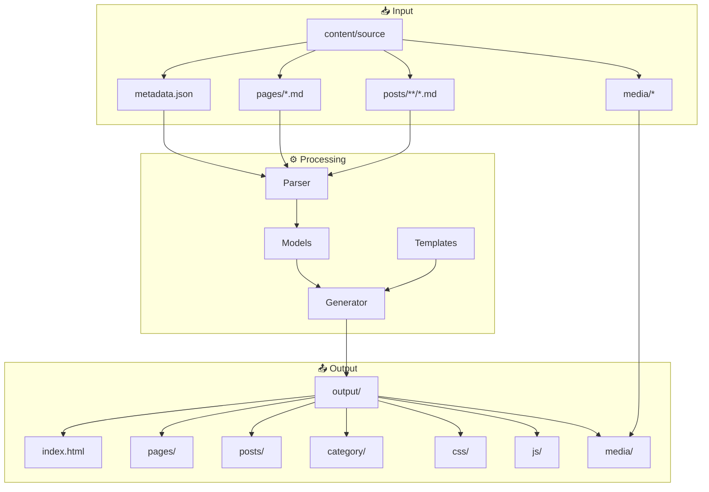

# SSG - Static Site Generator

[](https://go.dev/)
[](https://goreportcard.com/report/github.com/spagu/ssg)
[](LICENSE)
[](https://github.com/spagu/ssg/actions/workflows/ci.yml)
[](https://codecov.io/gh/spagu/ssg)
[](action.yml)
[](https://github.com/spagu/ssg/issues)
[](https://github.com/spagu/ssg/stargazers)
[](https://github.com/spagu/ssg/network)

🐄 **SSG** - A simple static site generator written in Go. Converts content from WordPress exports (Markdown format with YAML frontmatter) to static HTML, CSS, and JS files.

## 📋 Table of Contents

- [Features](#-features)
- [Requirements](#-requirements)
- [Installation](#-installation)
- [Usage](#-usage)
- [GitHub Actions](#-github-actions)
- [Project Structure](#-project-structure)
- [Templates](#-templates)
- [Styles/Colors](#-stylescolors)
- [Architecture](#-architecture)
- [Testing](#-testing)
- [Development](#-development)

## ✨ Features

- 🚀 Fast static site generation
- 📝 Markdown support with YAML frontmatter
- 🎨 Two templates: **simple** (dark theme) and **krowy** (green/natural theme)
- 📱 Responsive design
- ♿ WCAG 2.2 compliant
- 🔍 SEO-friendly URLs (clean addresses)
- 📁 Automatic media file copying
- 🏷️ Category support
- 🖼️ WebP image conversion (--webp flag)
- 📦 Cloudflare Pages deployment package (--zip flag)
- 🎬 **GitHub Actions integration** - Use as a step in CI/CD pipelines

## 📦 Requirements

- Go 1.25 or later
- Make (optional, for Makefile)
- cwebp (optional, for --webp image conversion)

## 🚀 Installation

```bash
# Clone the repository
git clone https://github.com/spagu/ssg.git
cd ssg

# Install dependencies and build
make all

# Or manually
go mod download
go build -o build/ssg ./cmd/ssg
```

## 💻 Usage

### Syntax

```bash
ssg <source> <template> <domain> [options]
```

### Arguments

| Argument | Description |
|----------|-------------|
| `source` | Source folder name (inside content-dir) |
| `template` | Template name (inside templates-dir) |
| `domain` | Target domain for the generated site |

### Options

| Option | Description |
|--------|-------------|
| `--zip` | Create ZIP file for Cloudflare Pages deployment |
| `--webp` | Convert images to WebP format (reduces size significantly) |
| `--content-dir=PATH` | Path to content directory (default: `content`) |
| `--templates-dir=PATH` | Path to templates directory (default: `templates`) |
| `--output-dir=PATH` | Path to output directory (default: `output`) |

### Examples

```bash
# Generate site with krowy template
./build/ssg krowy.net.2026-01-13110345 krowy krowy.net

# Generate with simple template (dark theme)
./build/ssg krowy.net.2026-01-13110345 simple krowy.net

# Generate with WebP conversion and ZIP package
./build/ssg krowy.net.2026-01-13110345 krowy krowy.net --webp --zip

# Use custom directories
./build/ssg my-content my-template example.com \
  --content-dir=/data/content \
  --templates-dir=/data/templates \
  --output-dir=/var/www/html

# Or using Makefile
make generate        # krowy template
make generate-simple # simple template
make serve           # generate and run local server
make deploy          # generate with WebP + ZIP for Cloudflare Pages
```

### Output

Generated files will be in the `output/` folder:

```
output/
├── index.html          # Homepage
├── css/
│   └── style.css       # Stylesheet
├── js/
│   └── main.js         # JavaScript
├── media/              # Media files
├── {slug}/             # Pages and posts (SEO URLs)
│   └── index.html
├── category/
│   └── {category-slug}/
│       └── index.html
├── sitemap.xml         # Sitemap for search engines
├── robots.txt          # Robots file
├── _headers            # Cloudflare Pages headers
└── _redirects          # Cloudflare Pages redirects
```

## 🎬 GitHub Actions

Use SSG as a GitHub Action in your CI/CD pipeline:

### Basic Usage

```yaml
- name: Generate static site
  uses: spagu/ssg@v1
  with:
    source: 'my-content'
    template: 'krowy'
    domain: 'example.com'
```

### Full Configuration

```yaml
- name: Generate static site
  id: ssg
  uses: spagu/ssg@v1
  with:
    source: 'my-content'           # Content folder (inside content/)
    template: 'krowy'              # Template: 'simple' or 'krowy'
    domain: 'example.com'          # Target domain
    content-dir: 'content'         # Optional: content directory path
    templates-dir: 'templates'     # Optional: templates directory path
    output-dir: 'output'           # Optional: output directory path
    webp: 'true'                   # Optional: convert images to WebP
    zip: 'true'                    # Optional: create ZIP for deployment

- name: Show outputs
  run: |
    echo "Output path: ${{ steps.ssg.outputs.output-path }}"
    echo "ZIP file: ${{ steps.ssg.outputs.zip-file }}"
    echo "ZIP size: ${{ steps.ssg.outputs.zip-size }} bytes"
```

### Action Inputs

| Input | Description | Required | Default |
|-------|-------------|----------|---------|
| `source` | Content source folder name | ✅ | - |
| `template` | Template name | ✅ | `simple` |
| `domain` | Target domain | ✅ | - |
| `content-dir` | Path to content directory | ❌ | `content` |
| `templates-dir` | Path to templates directory | ❌ | `templates` |
| `output-dir` | Path to output directory | ❌ | `output` |
| `webp` | Convert images to WebP | ❌ | `false` |
| `zip` | Create ZIP file | ❌ | `false` |

### Action Outputs

| Output | Description |
|--------|-------------|
| `output-path` | Path to generated site directory |
| `zip-file` | Path to ZIP file (if --zip used) |
| `zip-size` | Size of ZIP file in bytes |

### Deploy to Cloudflare Pages

```yaml
name: Deploy

on:
  push:
    branches: [main]

jobs:
  deploy:
    runs-on: ubuntu-latest
    steps:
      - uses: actions/checkout@v6

      - name: Generate site
        id: ssg
        uses: spagu/ssg@v1
        with:
          source: 'my-content'
          template: 'krowy'
          domain: 'example.com'
          webp: 'true'

      - name: Deploy to Cloudflare
        uses: cloudflare/pages-action@v1
        with:
          apiToken: ${{ secrets.CLOUDFLARE_API_TOKEN }}
          accountId: ${{ secrets.CLOUDFLARE_ACCOUNT_ID }}
          projectName: 'my-site'
          directory: ${{ steps.ssg.outputs.output-path }}
```

## 📁 Project Structure

```
ssg/
├── cmd/
│   └── ssg/
│       └── main.go           # CLI entry point
├── internal/
│   ├── generator/
│   │   ├── generator.go      # Generator logic
│   │   ├── generator_test.go # Generator tests
│   │   └── templates.go      # Default HTML templates
│   ├── models/
│   │   └── content.go        # Data models
│   └── parser/
│       ├── markdown.go       # Markdown parser
│       └── markdown_test.go  # Parser tests
├── content/                  # Source data
│   └── {source}/
│       ├── metadata.json
│       ├── media/
│       ├── pages/
│       └── posts/
├── templates/                # Templates
│   ├── simple/
│   │   ├── css/
│   │   └── js/
│   └── krowy/
│       ├── css/
│       └── js/
├── output/                   # Generated site (gitignored)
├── go.mod
├── go.sum
├── Makefile
├── README.md
├── CHANGELOG.md
├── .gitignore
└── .dockerignore
```

## 🎨 Templates

### simple - Modern Dark Theme

Elegant dark theme with glassmorphism and gradients:
- Dark background: `#0f0f0f`
- Cards: `#222222`
- Accent: purple gradient `#6366f1` → `#a855f7`
- Hover animations and micro-interactions

### krowy - Green Farm Theme

Natural light theme inspired by krowy.net:
- Light background: `#f8faf5`
- Cards: `#ffffff`
- Accent: green `#2d7d32`
- Cow icon 🐄 in logo
- Nature and ecology focus

## 🎨 Styles/Colors

### Color Guidelines (WCAG 2.2 Compliant)

#### Simple Template (Dark)
```css
/* Background */
--color-bg-primary: #0f0f0f;
--color-bg-secondary: #1a1a1a;
--color-bg-card: #222222;

/* Text (minimum contrast 4.5:1) */
--color-text-primary: #ffffff;
--color-text-secondary: #b3b3b3;
--color-text-muted: #808080;

/* Accent */
--color-accent: #6366f1;
--gradient-primary: linear-gradient(135deg, #6366f1 0%, #8b5cf6 50%, #a855f7 100%);
```

#### Krowy Template (Light)
```css
/* Background */
--color-bg-primary: #f8faf5;
--color-bg-secondary: #ffffff;
--color-bg-card: #ffffff;

/* Text (minimum contrast 4.5:1) */
--color-text-primary: #1a2e1a;
--color-text-secondary: #3d5a3d;
--color-text-muted: #6b8a6b;

/* Accent */
--color-accent: #2d7d32;
--gradient-primary: linear-gradient(135deg, #2d7d32 0%, #43a047 50%, #66bb6a 100%);
```

Detailed style documentation: [docs/STYLES.md](docs/STYLES.md)

## 🏗️ Architecture



## 🧪 Testing

```bash
# Run all tests
make test

# Tests with coverage
make test-coverage

# Open coverage report
open coverage.html
```

## 🛠️ Development

### Available Make Commands

```bash
make help           # Show all commands
make all            # deps + lint + test + build
make build          # Build binary
make test           # Run tests
make lint           # Check code
make run            # Build and run
make generate       # Generate site (krowy template)
make generate-simple # Generate site (simple template)
make serve          # Generate and serve locally
make deploy         # Generate with WebP + ZIP for Cloudflare Pages
make clean          # Clean artifacts
make install        # Install binary to /usr/local/bin
```

### Creating Your Own Template

1. Create a folder in `templates/your-template-name/`
2. Add files:
   - `css/style.css`
   - `js/main.js` (optional)
   - `index.html`, `page.html`, `post.html`, `category.html` (optional)
3. HTML templates are generated automatically if missing

## 📄 License

MIT License - see [LICENSE](LICENSE)

## 👥 Authors

- **spagu** - [GitHub](https://github.com/spagu)
