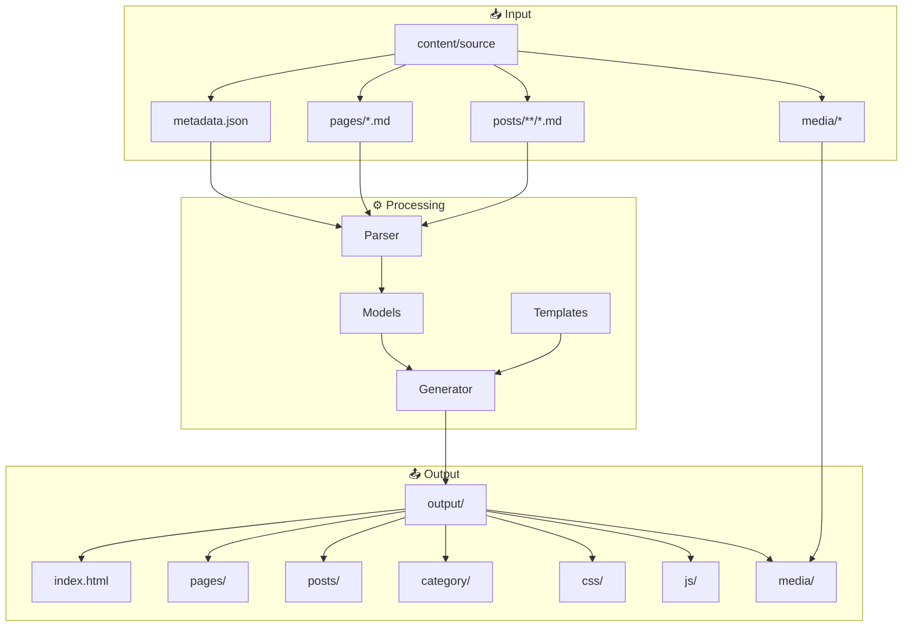

# SSG - Static Site Generator

[](https://go.dev/)
[](https://goreportcard.com/report/github.com/spagu/ssg)
[](LICENSE)
[](https://github.com/spagu/ssg/actions/workflows/ci.yml)
[](https://codecov.io/gh/spagu/ssg)
[](action.yml)
[](https://github.com/spagu/ssg/issues)
[](https://github.com/spagu/ssg/stargazers)
[](https://github.com/spagu/ssg/releases)
[](https://github.com/spagu/ssg/actions/workflows/docker.yml)
[](https://github.com/spagu/ssg/network)
[](https://securityscorecards.dev/viewer/?uri=github.com/spagu/ssg)

A fast and flexible [static site generator](https://en.wikipedia.org/wiki/Static_site_generator) built in [Go](https://go.dev/), designed for simplicity and speed.

[Website](https://github.com/spagu/ssg) | [Installation](#-installation) | [Documentation](#-usage) | [Contributing](CONTRIBUTORS.md) | [Security](SECURITY.md)

---

## 🔍 Overview

**SSG** is a static site generator written in [Go](https://go.dev/), optimized for converting WordPress exports (Markdown with YAML frontmatter) to blazing-fast static websites. With its simple architecture, multiple template engine support, and powerful asset pipelines, SSG renders a complete site in milliseconds.

### What Can You Build?

SSG is perfect for creating:

- 📰 **Blogs** - Personal or professional blogs migrated from WordPress
- 🏢 **Corporate sites** - Fast, secure company websites
- 📚 **Documentation** - Technical docs with clean SEO URLs
- 🎨 **Portfolios** - Image galleries and creative showcases
- 📄 **Landing pages** - Marketing and product pages
- 📝 **Personal sites** - Resumes, CVs, and personal branding

### Key Capabilities

| Feature | Description |
|---------|-------------|
| **⚡ Lightning Fast** | Go-powered generation completes in milliseconds |
| **🎭 Multiple Engines** | Go templates, Pongo2 (Jinja2), Mustache, Handlebars |
| **🌐 Hugo Themes** | Download and use Hugo themes from GitHub |
| **🖼️ Image Pipeline** | WebP conversion with quality control |
| **📦 Asset Bundling** | HTML, CSS, JS minification |
| **🔄 Live Reload** | Built-in server with file watching |
| **🐳 Docker Ready** | Minimal Alpine image (~15MB) |
| **🎬 CI/CD Native** | First-class GitHub Actions support |

### Development Workflow

Use SSG's embedded web server during development to instantly see changes to content, structure, and presentation. The watch mode automatically rebuilds your site when files change:

```bash
# Start development server with auto-rebuild
ssg my-content krowy example.com --http --watch
```

Then let SSG **publish it for you** with `--deploy=` (native, no external CLI):
- **Cloudflare Pages** - `--deploy=cloudflare` (Direct Upload API)
- **GitHub Pages** - `--deploy=github-pages` (force-push to gh-pages)
- **Netlify / Vercel** - `--deploy=netlify` / `--deploy=vercel` (deploy APIs)
- **Any web server** - `--deploy=ftp` / `--deploy=sftp`, or just copy the output folder

See [Publishing (native deploy)](#-publishing-native-deploy) for details.

### Asset Processing

SSG includes powerful asset processing:

- **Image Processing** - Convert JPG/PNG to WebP with configurable quality
- **Co-located Assets** - Images placed next to Markdown files are auto-copied to output
- **HTML Minification** - Remove whitespace, comments, optimize output
- **CSS Minification** - Bundle and compress stylesheets
- **JS Minification** - Optimize JavaScript files
- **SEO Automation** - Sitemap, robots.txt, clean URLs, meta tags

## ✨ Features

### Core Features
- 🚀 **Fast generation** - Go-powered, millisecond builds
- 📝 **Markdown** - Full support with YAML frontmatter
- 🎨 **Built-in templates** - `simple` (dark) and `krowy` (green/natural)
- 📱 **Responsive** - Mobile-first design
- ♿ **Accessible** - WCAG 2.2 compliant
- 🔍 **SEO** - Clean URLs, sitemap, robots.txt

### Template Engines
- 🔧 **Go Templates** - Default, powerful templating (`.Variable`)
- 🐍 **Pongo2** - Jinja2/Django syntax (for loops, filters)
- 👨‍🦱 **Mustache** - Logic-less templates (sections)
- 🔨 **Handlebars** - Semantic templates (each blocks)

### Development
- 🌐 **HTTP Server** - Built-in dev server (`--http`)
- 👀 **Watch Mode** - Auto-rebuild on changes (`--watch`)
- 📄 **Config Files** - YAML, TOML, JSON support
- 🧹 **Clean Builds** - Fresh output (`--clean`)

### Production
- 🖼️ **WebP Conversion** - Optimized images (`--webp`)
- 🗄️ **Minification** - HTML, CSS, JS (`--minify-all`)
- 📦 **Deployment Package** - ZIP / tar.gz / tar.xz (`--zip` `--targz` `--tarxz`)
- 🔒 **Public Server** - Optional TLS, HTTP/2, HTTP/3, gzip, connection/memory limits
- 🐳 **Docker** - Multi-arch Alpine image (amd64, arm64, armv7)

### Integration
- 🎬 **GitHub Actions** - Use as CI/CD step
- 🌍 **Online Themes** - Download Hugo themes from URL
- 📁 **WordPress** - Import from WP exports
- 🗃️ **MDDB** - Fetch content from [MDDB](https://github.com/tradik/mddb) markdown database

## 📦 Requirements

- Go 1.26 or later
- Make (optional, for Makefile)
- `cwebp` (optional, for WebP conversion)

## 🚀 Installation

### Quick Install (Linux/macOS)

```bash
curl -sSL https://raw.githubusercontent.com/spagu/ssg/main/install.sh | bash
```

### Package Managers

| Platform | Command |
|----------|---------|
| **Homebrew** (macOS/Linux) | `brew install spagu/tap/ssg` |
| **Snap** (Ubuntu) | `snap install static-site-generator && sudo snap alias static-site-generator ssg` |
| **Debian/Ubuntu** | `wget https://github.com/spagu/ssg/releases/download/v1.8.1/ssg_1.8.1_amd64.deb && sudo dpkg -i ssg_1.8.1_amd64.deb` |
| **Fedora/RHEL** | `sudo dnf install https://github.com/spagu/ssg/releases/download/v1.8.1/ssg-1.8.1-1.x86_64.rpm` |
| **FreeBSD** | `pkg install ssg` or from ports |
| **OpenBSD** | From ports: `/usr/ports/www/ssg` |

### Binary Downloads

Download pre-built binaries from [GitHub Releases](https://github.com/spagu/ssg/releases):

| Platform | AMD64 | ARM64 |
|----------|-------|-------|
| Linux | [ssg-linux-amd64.tar.gz](https://github.com/spagu/ssg/releases/latest) | [ssg-linux-arm64.tar.gz](https://github.com/spagu/ssg/releases/latest) |
| macOS | [ssg-darwin-amd64.tar.gz](https://github.com/spagu/ssg/releases/latest) | [ssg-darwin-arm64.tar.gz](https://github.com/spagu/ssg/releases/latest) |
| FreeBSD | [ssg-freebsd-amd64.tar.gz](https://github.com/spagu/ssg/releases/latest) | [ssg-freebsd-arm64.tar.gz](https://github.com/spagu/ssg/releases/latest) |
| Windows | [ssg-windows-amd64.zip](https://github.com/spagu/ssg/releases/latest) | [ssg-windows-arm64.zip](https://github.com/spagu/ssg/releases/latest) |

> **Previous versions:** the DEB/RPM commands above pin the current release (`v1.8.1`).
> For an older version, replace it with the tag you want — every release (with per-version
> changes) is listed on the [Releases page](https://github.com/spagu/ssg/releases) and in
> the [CHANGELOG](CHANGELOG.md). Tarball/ZIP links use `/releases/latest/` so they always
> resolve to the newest build.

### From Source

```bash
git clone https://github.com/spagu/ssg.git
cd ssg
make build
sudo make install
```

### Docker

```bash
# Pull from Docker Hub
docker pull tradik/ssg:latest

# Or from GitHub Container Registry
docker pull ghcr.io/spagu/ssg:latest

# Run SSG in container
docker run --rm -v $(pwd):/site tradik/ssg:latest \
    my-content krowy example.com --webp

# Or use docker-compose
docker compose run --rm ssg my-content krowy example.com

# Development server with watch mode
docker compose up dev
```

📖 **Full installation guide:** [docs/INSTALL.md](docs/INSTALL.md)

## 💻 Usage

### Syntax

```bash
ssg <source> <template> <domain> [options]
```

### Arguments

| Argument | Description |
|----------|-------------|
| `source` | Source folder name (inside content-dir) |
| `template` | Template name (inside templates-dir) |
| `domain` | Target domain for the generated site |

### Configuration File

SSG supports configuration files in YAML, TOML, or JSON format. Auto-detects: `.ssg.yaml`, `.ssg.toml`, `.ssg.json`

```bash
# Use explicit config file
ssg --config .ssg.yaml

# Or just create .ssg.yaml and run ssg (auto-detected)
ssg
```

Example `.ssg.yaml`:

```yaml
source: "my-content"
template: "krowy"
domain: "example.com"

http: true
watch: true
clean: true
webp: true
webp_quality: 80
minify_all: true
page_format: "directory"  # "directory" (slug/index.html), "flat" (slug.html), or "both"
```

Example `.ssg.yaml` with MDDB:

```yaml
template: "krowy"
domain: "example.com"

# MDDB content source (replaces local files)
mddb:
  enabled: true
  url: "http://localhost:11023"  # HTTP port
  # url: "localhost:11024"       # gRPC port (faster)
  protocol: "http"               # "http" (default) or "grpc"
  collection: "blog"
  lang: "en_US"
  api_key: ""                    # optional
  timeout: 30
  batch_size: 1000
  watch: true                    # auto-rebuild on content changes
  watch_interval: 30             # polling interval in seconds

minify_all: true
```

See [.ssg.yaml.example](.ssg.yaml.example) for all options.

### Options

**Configuration:**

| Option | Description |
|--------|-------------|
| `--config=FILE` | Load config from YAML/TOML/JSON file |

**Server & Development:**

| Option | Description |
|--------|-------------|
| `--http` | Start built-in HTTP server (default port: 8888) |
| `--host=ADDR` | Dev server bind address (default: `127.0.0.1`; use `0.0.0.0` to expose on all interfaces) |
| `--port=PORT` | HTTP server port (default: `8888`) |
| `--watch` | Watch for changes and rebuild automatically |
| `--clean` | Clean output directory before build |

**Public Server Hardening (TLS / HTTP/2 / HTTP/3 — opt-in):**

The built-in server can face the public internet directly. All options below are off by
default; enabling TLS negotiates HTTP/2 automatically (ALPN).

| Option | Description |
|--------|-------------|
| `--tls-cert=FILE` `--tls-key=FILE` | Serve HTTPS from a manual PEM certificate/key pair (enables HTTP/2) |
| `--tls-auto` `--tls-domain=HOST` | Automatic Let's Encrypt certificates via `autocert` (bind port 443; comma-separate multiple domains) |
| `--http3` | Serve HTTP/3 (QUIC) alongside HTTP/2 and advertise it via `Alt-Svc` (requires TLS) |
| `--gzip` | gzip-compress responses when the client sends `Accept-Encoding: gzip` |
| `--max-conns=N` | Cap simultaneous connections (`0` = unlimited) |
| `--mem-limit=SIZE` | Runtime GC soft memory target, e.g. `512MiB`, `1GiB` |

Security headers (`X-Content-Type-Options`, `X-Frame-Options`, `Referrer-Policy`, and HSTS
under TLS) and cache-control (immutable for fingerprinted assets, `no-cache` for HTML) are
applied automatically by the server.

**Output Control:**

| Option | Description |
|--------|-------------|
| `--sitemap-off` | Disable sitemap.xml generation. Pages with `robots: "noindex"`, `layout: "redirect"`, or `sitemap: "no"` are excluded automatically |
| `--robots-off` | Disable robots.txt generation |
| `--pretty-html` | Prettify HTML (remove all blank lines) |
| `--relative-links` | Convert absolute URLs to relative links |
| `--post-url-format=FMT` | Post URL format: `date` (default: `/YYYY/MM/DD/slug/`) or `slug` (`/slug/`) |
| `--page-format=FMT` | Page output: `directory` (default: `slug/index.html`), `flat` (`slug.html`), `both` |
| `--minify-all` | Minify HTML, CSS, and JS |
| `--minify-html` | Minify HTML output |
| `--minify-css` | Minify CSS output |
| `--minify-js` | Minify JS output |
| `--sourcemap` | Emit v3 source maps (`*.js.map`/`*.css.map`) for minified JS/CSS (minification is line-preserving so mappings are exact) |
| `--fingerprint` | Content-hash CSS/JS to `name.<hash8>.ext` + `assets-manifest.json`, rewriting references in HTML/CSS (immutable caching) |
| `--paginate=N` | Posts per index page; adds `/page/N/` + a `.Pager` context. `0` = disabled (default) |
| `--lastmod-from-git` | Derive sitemap `<lastmod>` from each source file's last git commit (fallback: `modified`/`date`) |
| `--permalink-post=PAT` | Post URL pattern with tokens `:year :month :day :slug :category` (e.g. `/:year/:month/:slug/`) |
| `--permalink-page=PAT` | Page URL pattern (same tokens) |

**Authoring:**

| Option | Description |
|--------|-------------|
| `--math` | Opt-in math: detects `$$…$$` / ` ```math ` and injects KaTeX only on pages that use it |
| `--sanitize-html` | Sanitize raw HTML embedded in markdown through the bluemonday UGC policy (strips `<script>` etc.) |
| `--highlight` | Syntax-highlight code blocks via Chroma |
| `--highlight-style=NAME` | Chroma style (e.g. `github`, `monokai`, `dracula`) |
| `--toc` | Expose `.TOC` to templates (`[toc]` in content always expands) |
| `--toc-depth=N` | Max heading level in the TOC (default: `3`) |

**Feeds, SEO & Search:**

| Option | Description |
|--------|-------------|
| `--feed` | Generate an Atom `feed.xml` at the root and per category/tag |
| `--feed-items=N` | Max items per feed (default: `20`) |
| `--check-links` / `--check-links=strict` | Validate internal links; `strict` fails the build on a dead link |
| `--search-index` | Emit `search-index.json` for client-side search |
| `--outputs=html,json` | Per-page output formats (`json` writes `index.json` next to `index.html`) |
| `--seo-off` | Disable the generator-level OG/Twitter/JSON-LD injection |

**Skip Minification:**

Use HTML comments to preserve whitespace in specific sections (e.g., Mermaid diagrams):

```html
<!-- htmlmin:ignore -->
<pre class="mermaid">
flowchart TD
    A --> B
    B --> C
</pre>
<!-- /htmlmin:ignore -->
```

**Image Processing (Native Go - no external tools needed):**

| Option | Description |
|--------|-------------|
| `--webp` | Convert images to WebP format (requires `cwebp`) |
| `--webp-quality=N` | WebP compression quality 1-100 (default: `60`) |
| `--reconvert-images` | Force reconversion even if a WebP already exists |
| `--image-sizes=A,B,C` | Responsive widths (px) → WebP variants + `` (no upscaling), e.g. `480,960,1600` |
| `--image-sizes-attr=VAL` | Value of the generated `sizes` attribute (default: `100vw`) |

**Deployment:**

| Option | Description |
|--------|-------------|
| `--zip` | Create a ZIP archive of the output tree (Cloudflare Pages ready) |
| `--targz` | Create a gzip-compressed tarball (`.tar.gz`) of the output tree |
| `--tarxz` | Create an xz-compressed tarball (`.tar.xz`) of the output tree |

**Paths:**

| Option | Description |
|--------|-------------|
| `--content-dir=PATH` | Content directory (default: `content`) |
| `--templates-dir=PATH` | Templates directory (default: `templates`) |
| `--output-dir=PATH` | Output directory (default: `output`) |
| `--static-dir=PATH` | Static passthrough directory copied verbatim to output (default: `static`) |
| `--data-dir=PATH` | Data files dir (`*.yaml`/`*.json`) exposed as `.Data.*` (default: `data`) |

**Internationalization:**

| Option | Description |
|--------|-------------|
| `--languages=pl,en` | Enable multilingual output; non-default languages are emitted under `/<lang>/…` with `hreflang` alternates |
| `--default-language=pl` | The default language (not prefixed in URLs) |

**Template Engine:**

| Option | Description |
|--------|-------------|
| `--engine=ENGINE` | Template engine: `go` (default), `pongo2`, `mustache`, `handlebars`. Non-Go engines render themes authored in that engine's syntax (no Go FuncMap/inheritance) |
| `--online-theme=URL` | Download theme from URL (GitHub, GitLab, or direct ZIP) |

**MDDB Content Source ([github.com/tradik/mddb](https://github.com/tradik/mddb)):**

| Option | Description |
|--------|-------------|
| `--mddb-url=URL` | MDDB server URL (enables mddb mode). HTTP: `http://localhost:11023`, gRPC: `localhost:11024` |
| `--mddb-protocol=PROTO` | Connection protocol: `http` (default) or `grpc` |
| `--mddb-collection=NAME` | Collection name for pages/posts |
| `--mddb-key=KEY` | API key for authentication (optional) |
| `--mddb-lang=LANG` | Language filter (e.g., `en_US`, `pl_PL`) |
| `--mddb-timeout=SEC` | Request timeout in seconds (default: `30`) |
| `--mddb-batch-size=N` | Batch size for pagination (default: `1000`) |
| `--mddb-watch` | Watch MDDB for changes and rebuild automatically |
| `--mddb-watch-interval=SEC` | Polling interval for watch mode (default: `30`) |

**Other:**

| Option | Description |
|--------|-------------|
| `--quiet`, `-q` | Suppress output (only exit codes) |
| `--version`, `-v` | Show version |
| `--help`, `-h` | Show help |

### New in v1.8.1

All additions below are **opt-in**; the default build (plain HTTP dev server, ZIP) is unchanged.

#### Public-facing server (TLS · HTTP/2 · HTTP/3)

```bash
# Manual certificate — HTTP/2 negotiated automatically, plus HTTP/3 and gzip
ssg my-site simple example.com --http --port=443 \
    --tls-cert=cert.pem --tls-key=key.pem --http3 --gzip --max-conns=1024

# Automatic Let's Encrypt certificate for one or more domains
ssg my-site simple example.com --http --port=443 \
    --tls-auto --tls-domain=example.com --mem-limit=512MiB
```

The server adds security headers (`X-Content-Type-Options`, `X-Frame-Options`,
`Referrer-Policy`, HSTS under TLS) and cache-control (immutable for fingerprinted assets,
`no-cache` for HTML) automatically.

#### Extra archive formats

```bash
ssg my-site simple example.com --zip --targz --tarxz
```

`--targz` and `--tarxz` sit alongside `--zip`, producing `.tar.gz` / `.tar.xz` of the
output tree.

#### HTML sanitization

```yaml
sanitize_html: true   # or --sanitize-html
```

Runs raw HTML embedded in markdown through the bluemonday UGC policy (strips `<script>`
and other unsafe markup).

#### Timezone-aware dates

```yaml
timezone: "Europe/Warsaw"   # or --timezone=Europe/Warsaw
language_timezones:         # optional per-language override (wins for that lang)
  en_US: "America/New_York"
  pl_PL: "Europe/Warsaw"
```

Renders content dates — the `:year/:month/:day` permalink tokens and the `Date`/`Modified`
template context — in the given IANA zone instead of UTC-as-parsed. Feeds and the sitemap
stay in UTC (per spec). The zone database is embedded, so static and Windows binaries work
without a system tzdata. Empty = previous behaviour (no conversion).

### New in v1.8.0

All features below are **opt-in** behind a config key or flag; the default build is unchanged.

#### Configurable permalinks (migration)

Preserve or remap WordPress URL structure. Tokens: `:year :month :day :slug :category`.

```yaml
permalinks:
  post: "/:year/:month/:slug/"
  page: "/:slug/"
```

The frontmatter `link:` field still takes priority over any pattern, and all expanded paths
are sanitized (cannot escape the output directory).

#### Frontmatter aliases (redirects)

```yaml
# in a post/page frontmatter
aliases:
  - /old/permalink/
  - /2019/legacy-path/
```

Each alias becomes a `meta-refresh` + `<link rel="canonical">` + `noindex` stub pointing at the
page's canonical URL. Aliases are excluded from `sitemap.xml`; a collision with a real page is
skipped with a warning.

#### Pagination

```yaml
paginate: 10
```

Page 1 is the site root; pages 2…N are written to `/page/N/`. Templates receive a `.Pager`:

```html
{{if gt .Pager.Total 1}}
  {{if .Pager.PrevURL}}<a rel="prev" href="{{.Pager.PrevURL}}">Prev</a>{{end}}
  <span>Page {{.Pager.Current}} / {{.Pager.Total}}</span>
  {{if .Pager.NextURL}}<a rel="next" href="{{.Pager.NextURL}}">Next</a>{{end}}
{{end}}
```

#### Reading time & word count

Exposed to every engine as `.WordCount` and `.ReadingTime` (minutes, 200 wpm):

```html
<span>{{.ReadingTime}} min read · {{.WordCount}} words</span>
```

#### Source maps

`--sourcemap` (with `--minify-js`/`--minify-css`) emits real v3 `*.js.map` / `*.css.map`
alongside minified assets. Minification becomes line-preserving so the mapping is exact and
the original source is embedded (`sourcesContent`).

#### Asset fingerprinting (cache busting)

```yaml
fingerprint: true
```

Renames CSS/JS to `name.<hash8>.ext`, writes `assets-manifest.json`, and rewrites references in
HTML and inside CSS (`url()` / `@import`, hashed in dependency order). Two identical builds
produce byte-identical names. Recommended headers: hashed assets
`Cache-Control: public, max-age=31536000, immutable`; HTML `no-cache`.

#### Responsive images

```yaml
webp: true
image_sizes: [480, 960, 1600]
image_sizes_attr: "100vw"
```

For each image the WebP pipeline emits `name-<width>.webp` variants (never upscaling) and adds
`srcset`/`sizes` to `` tags, keeping the original as the fallback `src`.

#### Math (KaTeX)

```yaml
math: true
```

Pages containing `$$…$$` (or ` ```math ` blocks) get KaTeX assets injected **only where needed**;
`.HasMath` is exposed to templates. Display math uses `$$…$$`, inline uses `\(…\)` (so `$` for
currency is safe).

#### Series

```yaml
# in a post frontmatter
series: "Learn Go"
```

Generates a `/series/{slug}/` landing page (`series.html`, falling back to `category.html`) and
exposes `.SeriesPrevURL` / `.SeriesPrevTitle` / `.SeriesNextURL` / `.SeriesNextTitle`.

#### Data files

Files under `data/` (`*.yaml`, `*.yml`, `*.json`) are loaded into `.Data.*`, nested by
subdirectory — `data/authors/bob.yaml` → `{{.Data.authors.bob.name}}`.

#### Internationalization

```yaml
languages: ["pl", "en"]
default_language: "pl"
```

Non-default languages are emitted under `/<lang>/…`. Templates receive `.Lang`, `.Languages`,
`.DefaultLanguage`, `.Translations` (for a language switcher) and `.Hreflang` (ready-to-drop
`<link rel="alternate" hreflang>` markup incl. `x-default`).

#### Build hooks

```yaml
hooks:
  pre_build:  ["./scripts/prepare.sh"]
  post_build: ["./scripts/deploy.sh"]
  post_page:  []
```

> ⚠️ **Security:** hooks run as **local, trusted config only** — argv-split (no shell),
> time-limited (60 s), and never sourced from content. Context is passed via the environment:
> `SSG_OUTPUT_DIR`, `SSG_PHASE`, and `SSG_PAGE_PATH` (for `post_page`). `pre_build`/`post_build`
> failures fail the build; `post_page` failures are logged and non-fatal.

#### `lastmod` from git

`--lastmod-from-git` (or `lastmod_from_git: true`) sets sitemap `<lastmod>` to each source
file's last commit date, falling back to `modified`/`date` outside a git repo or for mddb content.

#### Incremental watch

`--watch` now hashes watched content and skips rebuilds when files were touched but their bytes
did not change. Any real change still triggers a full, correct rebuild.

### Shortcodes

Define reusable content snippets in your config file. Each shortcode requires a template file:

```yaml
shortcodes:
  - name: "thunderpick"
    template: "shortcodes/banner.html"  # Required: template in theme folder
    title: "Thunderpick"
    text: "100% up to $1000 + 5% rakeback"
    url: "https://example.com/promo"
    logo: "/assets/images/thunderpick.png"
    legal: "18+. Gamble Responsibly. T&Cs Apply."
```

Create the template file (e.g., `templates/your-theme/shortcodes/banner.html`):

```html
<div class="promo-banner">
  <a href="{{.URL}}">
    {{if .Logo}}{{end}}
    <strong>{{.Title}}</strong>
    <span>{{.Text}}</span>
  </a>
  {{if .Legal}}<small>{{.Legal}}</small>{{end}}
</div>
```

Use in markdown content with `{{shortcode_name}}`:

```markdown
Check out this amazing offer:

{{thunderpick}}

Don't miss it!
```

**Available template variables:** `{{.Name}}`, `{{.Title}}`, `{{.Text}}`, `{{.URL}}`, `{{.Logo}}`, `{{.Legal}}`, `{{.Data.key}}`

#### WordPress-style bracket syntax

Enable `[shortcode_name]` syntax (in addition to `{{shortcode_name}}`):

```yaml
shortcode_brackets: true  # default: false
```

When enabled, `[thunderpick]` in content is replaced with the rendered shortcode HTML — but only for shortcodes defined in your config. Unknown `[tags]` are left untouched.

Bracket shortcodes also support **attributes** and **closing tags**:

```markdown
<!-- Self-closing with attributes -->
[link url="https://example.com" label="Click here"]

<!-- With inner content -->
[box]This content is wrapped in a box.[/box]

<!-- Combined -->
[alert type="warning"]Watch out for this![/alert]
```

In the shortcode template, use `{{.Attrs.key}}` for inline attributes and `{{.InnerContent}}` for content between tags. Config-defined fields (Title, Text, etc.) remain available alongside inline attrs.

### Config Variables

Define custom variables in `.ssg.yaml` that are available in every template as `{{.Vars.key}}` and automatically exported as `SSG_*` environment variables:

```yaml
variables:
  gtm: "GTM-XXXXXXX"          # {{.Vars.gtm}}, exported as SSG_GTM
  analytics_id: "$GA_ID"       # Value resolved from $GA_ID env var at build time
  api:
    endpoint: "https://api.example.com"  # {{.Vars.api.endpoint}}, exported as SSG_API_ENDPOINT
```

Use in templates:

```html
<!-- GTM snippet using a config variable -->
{{if .Vars.gtm}}
<script>(function(w,d,s,l,i){...})(window,document,'script','dataLayer','{{.Vars.gtm}}');</script>
{{end}}
```

**Features:**
- Flat and nested structures supported
- Values starting with `$` are resolved from OS environment variables at build time
- All variables exported as env vars: `SSG_GTM`, `SSG_API_ENDPOINT`, etc.
- Available in index, page, post, and category templates

### Custom Content Paths

Override the default `pages/` and `posts/` subdirectory names:

```yaml
pages_path: "docs"      # reads from content/{source}/docs/ instead of pages/
posts_path: "articles"  # reads from content/{source}/articles/ instead of posts/
```

### Static Passthrough Directory

Anything placed in the project-level `static/` directory is copied **verbatim** into
the output during generation — every file and subdirectory, recursively. This is the
place for assets that SSG does not generate itself: `downloads/`, `assets/`, `scripts/`,
`styles/`, `manifest.json`, favicons, etc.

```
static/
├── downloads/guide.pdf   →  output/downloads/guide.pdf
├── assets/app.css        →  output/assets/app.css
└── manifest.json         →  output/manifest.json
```

Point it elsewhere (or disable it by naming a non-existent path) with `static_dir:`
in config or `--static-dir=PATH` on the CLI. A missing directory is a silent no-op,
so sites that do not use one are unaffected.

### Slug Handling

Slugs come from the `slug:` frontmatter field. When not set, the slug is automatically derived from the source filename (without `.md` extension).

By default slugs are **lowercased** (`API.md` → `/api/`). To preserve original casing:

```yaml
preserve_slug_case: true   # API.md → /API/, Hello-World.md → /Hello-World/
```

### Rewrite `.md` Links

When Markdown files cross-reference each other with `.md` links, enable automatic rewriting to final output URLs:

```yaml
rewrite_md_links: true
```

```markdown
See [Authentication](AUTHENTICATION.md) for details.
See [Quickstart](../quickstart/README.md) or [API](./API.md).
```

Becomes in the rendered HTML:

```html
<a href="/authentication/">Authentication</a>
<a href="/quickstart/">Quickstart</a>
<a href="/api/">API</a>
```

**How it works:**
- Matches the base filename (strips `./` and `../dir/` prefixes)
- Priority: exact source filename → lowercase filename → slug-derived name
- Unknown `.md` links are left untouched
- Disabled by default to avoid breaking sites that serve raw `.md` files

### Examples

```bash
# Development mode: HTTP server + auto-rebuild on changes
./build/ssg my-content krowy example.com --http --watch

# HTTP server on custom port
./build/ssg my-content krowy example.com --http --port=3000

# Generate site with krowy template
./build/ssg krowy.net.2026-01-13110345 krowy krowy.net

# Generate with simple template (dark theme)
./build/ssg krowy.net.2026-01-13110345 simple krowy.net

# Generate with WebP conversion and ZIP package
./build/ssg krowy.net.2026-01-13110345 krowy krowy.net --webp --zip

# Use custom directories
./build/ssg my-content my-template example.com \
  --content-dir=/data/content \
  --templates-dir=/data/templates \
  --output-dir=/var/www/html

# Or using Makefile
make generate        # krowy template
make generate-simple # simple template
make serve           # generate and run local server
make deploy          # generate with WebP + ZIP for Cloudflare Pages

# Fetch content from MDDB server (HTTP)
./build/ssg --mddb-url=http://localhost:11023 --mddb-collection=blog krowy example.com

# Use gRPC connection (faster)
./build/ssg --mddb-url=localhost:11024 --mddb-protocol=grpc --mddb-collection=blog krowy example.com

# MDDB with language filter and API key
./build/ssg --mddb-url=https://mddb.example.com --mddb-collection=site \
  --mddb-lang=en_US --mddb-key=secret krowy example.com --minify-all

# Watch MDDB for changes and auto-rebuild
./build/ssg --mddb-url=http://localhost:11023 --mddb-collection=blog \
  --mddb-watch --mddb-watch-interval=15 krowy example.com --http
```

### Output

Generated files will be in the `output/` folder:

```
output/
├── index.html          # Homepage
├── css/
│   └── style.css       # Stylesheet
├── js/
│   └── main.js         # JavaScript
├── media/              # Media files
├── {slug}/             # Pages and posts (SEO URLs)
│   └── index.html
├── category/
│   └── {category-slug}/
│       └── index.html
├── sitemap.xml         # Sitemap for search engines
├── robots.txt          # Robots file
├── _headers            # Cloudflare Pages headers
└── _redirects          # Cloudflare Pages redirects
```

## 🔧 Template Engines

SSG renders templates with the Go (`html/template`) engine by default, and can also
render themes authored in Pongo2, Mustache, or Handlebars (GO-007).

### Available Engines

| Engine | Flag | Status |
|--------|------|--------|
| Go (default) | `--engine=go` | ✅ Supported — `.Variable`, `range .Items`, full FuncMap + template inheritance |
| Pongo2 (Jinja2/Django) | `--engine=pongo2` (aliases `jinja2`, `django`) | ✅ Supported — `{{ var }}`, ``, filters |
| Mustache | `--engine=mustache` | ✅ Supported — logic-less `{{var}}` / `{{#section}}` |
| Handlebars | `--engine=handlebars` | ✅ Supported — `{{var}}`, `{{#each}}`, helpers |

> **Note:** Non-Go engines render the theme's **own** templates verbatim in that engine's
> syntax — they do **not** get the Go `html/template` FuncMap or block inheritance. Ship an
> alt-engine theme with templates written for that engine; the same page context
> (`.Page`, `.Site`, `.Posts`, `.Domain`, `.Vars`, `.Data`, …) is exposed to all of them.

### Usage Examples

```bash
# Use the Go engine (default)
ssg my-content mytheme example.com --engine=go

# Render a Jinja2/Django-style theme
ssg my-content mytheme example.com --engine=pongo2

# Logic-less Mustache theme
ssg my-content mytheme example.com --engine=mustache

# Handlebars theme
ssg my-content mytheme example.com --engine=handlebars
```

### Online Themes

Download themes directly from GitHub, GitLab, or any ZIP URL:

```bash
# Download Hugo theme from GitHub
ssg my-content bearblog example.com --online-theme=https://github.com/janraasch/hugo-bearblog

# Download from any URL
ssg my-content mytheme example.com --online-theme=https://example.com/theme.zip
```

The theme will be downloaded and extracted to `templates/{template-name}/`.

### Template Syntax Comparison

**Go Templates:**


```html
{{ range .Posts }}
  <h2>{{ .Title }}</h2>
  <p>{{ .Content }}</p>
{{ end }}
```


**Pongo2 (Jinja2):**


```html

  <h2>{{ post.Title }}</h2>
  <p>{{ post.Content }}</p>

```


**Mustache:**


```html
{{#Posts}}
  <h2>{{Title}}</h2>
  <p>{{Content}}</p>
{{/Posts}}
```


**Handlebars:**


```html
{{#each Posts}}
  <h2>{{Title}}</h2>
  <p>{{Content}}</p>
{{/each}}
```


## 🎬 GitHub Actions

Use SSG as a GitHub Action in your CI/CD pipeline:

### Versioning

| Reference | Description |
|-----------|-------------|
| `spagu/ssg@main` | Latest from main branch (development) |
| `spagu/ssg@v1` | Latest stable v1.x release |
| `spagu/ssg@v1.6.0` | Specific version |

> **Note:** Use `@main` until a stable release is published.

### Basic Usage

```yaml
- name: Generate static site
  uses: spagu/ssg@main  # or @v1 after release
  with:
    source: 'my-content'
    template: 'krowy'
    domain: 'example.com'
```

### Full Configuration


```yaml
- name: Generate static site
  id: ssg
  uses: spagu/ssg@v1
  with:
    source: 'my-content'           # Content folder (inside content/)
    template: 'krowy'              # Template: 'simple' or 'krowy'
    domain: 'example.com'          # Target domain
    version: 'latest'              # Optional: SSG version (default: latest)
    content-dir: 'content'         # Optional: content directory path
    templates-dir: 'templates'     # Optional: templates directory path
    output-dir: 'output'           # Optional: output directory path
    webp: 'true'                   # Optional: convert images to WebP
    webp-quality: '80'             # Optional: WebP quality 1-100 (default: 60)
    zip: 'true'                    # Optional: create ZIP for deployment
    minify: 'true'                 # Optional: minify HTML/CSS/JS
    clean: 'true'                  # Optional: clean output before build

- name: Show outputs
  run: |
    echo "Output path: ${{ steps.ssg.outputs.output-path }}"
    echo "ZIP file: ${{ steps.ssg.outputs.zip-file }}"
    echo "ZIP size: ${{ steps.ssg.outputs.zip-size }} bytes"
```


### Action Inputs

| Input | Description | Required | Default |
|-------|-------------|----------|---------|
| `source` | Content source folder name | ✅ | - |
| `template` | Template name | ✅ | `simple` |
| `domain` | Target domain | ✅ | - |
| `version` | SSG version to download | ❌ | `latest` |
| `content-dir` | Path to content directory | ❌ | `content` |
| `templates-dir` | Path to templates directory | ❌ | `templates` |
| `output-dir` | Path to output directory | ❌ | `output` |
| `webp` | Convert images to WebP | ❌ | `false` |
| `webp-quality` | WebP compression quality 1-100 | ❌ | `60` |
| `zip` | Create ZIP file | ❌ | `false` |
| `minify` | Minify HTML, CSS, and JS | ❌ | `false` |
| `clean` | Clean output directory before build | ❌ | `false` |
| `engine` | Template engine: `go`, `pongo2`, `mustache`, `handlebars` | ❌ | `go` |
| `online-theme` | Download a theme from a URL | ❌ | - |
| `deploy` | Native deploy: `cloudflare`, `github-pages`, `netlify`, `vercel`, `ftp`, `sftp` | ❌ | - |
| `deploy-project` | Pages/site/project name (cloudflare, netlify, vercel) | ❌ | - |
| `deploy-branch` | Target branch (cloudflare, github-pages) | ❌ | - |
| `deploy-target` | ftp/sftp URL or git remote | ❌ | - |

> Deploy secrets (`CLOUDFLARE_API_TOKEN`, `NETLIFY_AUTH_TOKEN`, `VERCEL_TOKEN`, `FTP_PASSWORD`, …)
> are read from the job `env:` — pass them as GitHub secrets, never as `with:` inputs.

### Action Outputs

| Output | Description |
|--------|-------------|
| `output-path` | Path to generated site directory |
| `zip-file` | Path to ZIP file (if --zip used) |
| `zip-size` | Size of ZIP file in bytes |

## 🚀 Publishing (native deploy)

SSG can publish the generated site **itself** — no `wrangler`, `netlify-cli`, `vercel`,
or `rsync` required. Pick a provider with `--deploy=` and SSG uploads the output tree
directly. **All secrets come from the environment**, never the config file.

| Provider | `--deploy=` | Needs | Environment |
|----------|-------------|-------|-------------|
| Cloudflare Pages | `cloudflare` | `--deploy-project=<pages-project>` | `CLOUDFLARE_API_TOKEN`, `CLOUDFLARE_ACCOUNT_ID` |
| GitHub Pages | `github-pages` | `--deploy-target=<git-remote>` (or repo `origin`) | `GITHUB_TOKEN` (https) or an SSH key |
| Netlify | `netlify` | `--deploy-project=<site-id>` | `NETLIFY_AUTH_TOKEN` (or `NETLIFY_SITE_ID`) |
| Vercel | `vercel` | `--deploy-project=<project>` | `VERCEL_TOKEN`, `VERCEL_ORG_ID` |
| FTP | `ftp` | `--deploy-target=ftp://host/path` | `FTP_USERNAME`, `FTP_PASSWORD` |
| SFTP/SSH | `sftp` | `--deploy-target=sftp://user@host/path` | `SSH_PASSWORD` or `SSH_KEY_FILE` (host must be in `known_hosts`) |

```bash
# Cloudflare Pages (Direct Upload API — hashes files, uploads only what changed)
export CLOUDFLARE_API_TOKEN=… CLOUDFLARE_ACCOUNT_ID=…
ssg my-content krowy example.com --deploy=cloudflare --deploy-project=my-site

# GitHub Pages — force-pushes the output as a single commit to gh-pages
export GITHUB_TOKEN=…
ssg my-content krowy example.com \
  --deploy=github-pages --deploy-target=https://github.com/user/repo.git

# Netlify (digest-based deploy API) / Vercel (files + deployment API)
NETLIFY_AUTH_TOKEN=… ssg my-content krowy example.com --deploy=netlify --deploy-project=<site-id>
VERCEL_TOKEN=…       ssg my-content krowy example.com --deploy=vercel  --deploy-project=<project>

# Any host over FTP or SFTP (SFTP verifies the host key against ~/.ssh/known_hosts)
FTP_PASSWORD=…  ssg my-content krowy example.com --deploy=ftp  --deploy-target=ftp://user@ftp.example.com/public_html
SSH_KEY_FILE=~/.ssh/id_ed25519 ssg my-content krowy example.com --deploy=sftp --deploy-target=sftp://deploy@example.com/var/www
```

Deploy runs **after** the build (and after any `--webp`/`--zip`), so it always ships
the final, processed output. The provider name can also be set in config as `deploy:`.

### Deploy from CI (GitHub Actions)

The same flags work in CI — set the provider secrets as repository secrets:


```yaml
name: Deploy
on:
  push:
    branches: [main]
jobs:
  deploy:
    runs-on: ubuntu-latest
    steps:
      - uses: actions/checkout@v6
      - name: Build and deploy
        uses: spagu/ssg@v1
        with:
          source: 'my-content'
          template: 'krowy'
          domain: 'example.com'
          webp: 'true'
          deploy: 'cloudflare'
          deploy-project: 'my-site'
        env:
          CLOUDFLARE_API_TOKEN: ${{ secrets.CLOUDFLARE_API_TOKEN }}
          CLOUDFLARE_ACCOUNT_ID: ${{ secrets.CLOUDFLARE_ACCOUNT_ID }}
```


> **📁 More workflow examples** are in [`examples/workflows/`](examples/workflows/).

## 📁 Project Structure

```
ssg/
├── cmd/
│   └── ssg/
│       └── main.go           # CLI entry point
├── internal/
│   ├── generator/
│   │   ├── generator.go      # Generator logic
│   │   ├── generator_test.go # Generator tests
│   │   └── templates.go      # Default HTML templates
│   ├── models/
│   │   └── content.go        # Data models
│   └── parser/
│       ├── markdown.go       # Markdown parser
│       └── markdown_test.go  # Parser tests
├── content/                  # Source data
│   └── {source}/
│       ├── metadata.json
│       ├── media/
│       ├── pages/
│       │   ├── about.md
│       │   └── about-photo.png  # Co-located asset (auto-copied)
│       └── posts/
├── templates/                # Templates
│   ├── simple/
│   │   ├── css/
│   │   └── js/
│   └── krowy/
│       ├── css/
│       └── js/
├── output/                   # Generated site (gitignored)
├── go.mod
├── go.sum
├── Makefile
├── README.md
├── CHANGELOG.md
├── .gitignore
└── .dockerignore
```

## 🎨 Templates

### simple - Modern Dark Theme

Elegant dark theme with glassmorphism and gradients:
- Dark background: `#0f0f0f`
- Cards: `#222222`
- Accent: purple gradient `#6366f1` → `#a855f7`
- Hover animations and micro-interactions

### krowy - Green Farm Theme

Natural light theme inspired by krowy.net:
- Light background: `#f8faf5`
- Cards: `#ffffff`
- Accent: green `#2d7d32`
- Cow icon 🐄 in logo
- Nature and ecology focus

## 🎨 Styles/Colors

### Color Guidelines (WCAG 2.2 Compliant)

#### Simple Template (Dark)
```css
/* Background */
--color-bg-primary: #0f0f0f;
--color-bg-secondary: #1a1a1a;
--color-bg-card: #222222;

/* Text (minimum contrast 4.5:1) */
--color-text-primary: #ffffff;
--color-text-secondary: #b3b3b3;
--color-text-muted: #808080;

/* Accent */
--color-accent: #6366f1;
--gradient-primary: linear-gradient(135deg, #6366f1 0%, #8b5cf6 50%, #a855f7 100%);
```

#### Krowy Template (Light)
```css
/* Background */
--color-bg-primary: #f8faf5;
--color-bg-secondary: #ffffff;
--color-bg-card: #ffffff;

/* Text (minimum contrast 4.5:1) */
--color-text-primary: #1a2e1a;
--color-text-secondary: #3d5a3d;
--color-text-muted: #6b8a6b;

/* Accent */
--color-accent: #2d7d32;
--gradient-primary: linear-gradient(135deg, #2d7d32 0%, #43a047 50%, #66bb6a 100%);
```

Detailed style documentation: [docs/STYLES.md](docs/STYLES.md)

## 📝 Content Format

SSG supports two markdown content formats:

### Standard Format (with section markers)

```markdown
---
title: "My Post"
slug: "my-post"
status: publish
type: post
date: 2026-04-01
---

## Excerpt
Short description for listings and meta tags.

## Content
Full markdown content goes here...
```

### Simple Format (without markers)

```markdown
---
title: "My Post"
slug: "my-post"
status: publish
type: page
---

All content after frontmatter becomes the page content.
No `## Excerpt` or `## Content` markers needed.

This is simpler for pages that don't need excerpts.
```

### Flexible Author & Categories

The `author` and `categories` fields accept both integer IDs and string values:

```yaml
# Integer IDs (classic)
author: 3
categories:
  - 1
  - 5

# String names — resolved to IDs via metadata lookup
author: "Jan Kowalski"
categories:
  - "Humor"
  - "Technology"

# String slugs — also resolved
author: "jan-kowalski"
categories:
  - "humor"
  - "technology"
```

Resolution is case-insensitive. Numeric strings (e.g., `author: "42"`) are parsed as integers automatically. Unresolved strings (no matching author/category in metadata) are silently ignored.

### Template Variables

All fields are available at template root level:

| Variable | Description |
|----------|-------------|
| `{{.Title}}` | Page/post title |
| `{{.Slug}}` | URL slug |
| `{{.Content}}` | Rendered HTML content |
| `{{.Excerpt}}` | Content excerpt |
| `{{.Date}}` | Publication date |
| `{{.URL}}` | Page URL path |
| `{{.CanonicalURL}}` | Full canonical URL |
| `{{.Description}}` | SEO meta description |
| `{{.customField}}` | Any custom frontmatter field |

For backward compatibility, `{{.Page.Title}}` and `{{.Post.Title}}` also work.

## 🏗️ Architecture


```mermaid
flowchart TB
    subgraph Input["📥 Input"]
        A[content/source] --> B[metadata.json]
        A --> C[pages/*.md]
        A --> D[posts/**/*.md]
        A --> E[media/*]
    end

    subgraph Processing["⚙️ Processing"]
        F[Parser] --> G[Models]
        G --> H[Generator]
        T[Templates] --> H
    end

    subgraph Output["📤 Output"]
        H --> I[output/]
        I --> J[index.html]
        I --> K[pages/]
        I --> L[posts/]
        I --> M[category/]
        I --> N[css/]
        I --> O[js/]
        I --> P[media/]
    end

    B --> F
    C --> F
    D --> F
    E --> P
```

## 🧪 Testing

```bash
# Run all tests
make test

# Tests with coverage
make test-coverage

# Open coverage report
open coverage.html
```

## 🛠️ Development

### Available Make Commands

```bash
make help           # Show all commands
make all            # deps + lint + test + build
make build          # Build binary
make test           # Run tests
make lint           # Check code
make run            # Build and run
make generate       # Generate site (krowy template)
make generate-simple # Generate site (simple template)
make serve          # Generate and serve locally
make deploy         # Generate with WebP + ZIP for Cloudflare Pages
make clean          # Clean artifacts
make install        # Install binary and man page to /usr/local
```

### Creating Your Own Template

1. Create a folder in `templates/your-template-name/`
2. Add files:
   - `css/style.css`
   - `js/main.js` (optional)
   - `index.html`, `page.html`, `post.html`, `category.html` (optional)
3. HTML templates are generated automatically if missing

## 📄 License

BSD 3-Clause License - see [LICENSE](LICENSE)

## 👥 Authors

- **spagu** - [GitHub](https://github.com/spagu)
