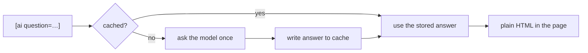

There are two places you can put an AI call on a website: in the visitor's
browser, or in your build. Almost everyone reaches for the first — a widget that
calls an API on page load — and almost everyone regrets it. It ships your API key
to the client (or forces a proxy you now maintain), it costs a request per
visitor, it renders a spinner where content should be, and search engines see an
empty box.

The build is the better place, and a static generator is exactly the tool for it.
The AI runs **once**, when you publish. The answer becomes plain HTML in the file.
Every visitor gets the same finished text, instantly, with no key, no spinner and
no runtime at all. SSG 1.8.16 makes that a one-liner in your content.

## The `[ai …]` shortcode

You declare a model once, in config, with the key in an environment variable:

```yaml
ai:
  default_model: fast
  cache_dir: .ai-cache
  models:
    fast:
      url: https://api.openai.com/v1/chat/completions
      key: $OPENAI_KEY
      model: gpt-4o-mini
      system: "Answer in one short, factual sentence."
```

Then you ask, from inside the Markdown:

```markdown
## TL;DR

[ai question="Summarise this release in one sentence: parallel rendering,
   AI content, related posts, notifications." fallback="_summary pending_"]
```

At build time SSG sends the question to the model, drops the answer in where the
shortcode was, and moves on. The reader sees a sentence, not a shortcode.

## The part that makes it usable: it's cached and deterministic

An AI that answers differently every time would be a disaster for a static site —
your pages would churn on every build, your diffs would be noise, and CI could
never reproduce a build. So answers are **content-addressed cached**: the key is a
hash of the model plus the exact question. Ask the same thing again and you get
the same cached answer without touching the network.



Commit the `cache_dir` and the payoff compounds: your CI rebuilds the exact same
content with **no API key and no network at all** — the answers are already in the
repo, versioned next to the words a human wrote. A rebuild after a typo fix costs
nothing. You re-query only when you change the question or the model.

## Ask only when it makes sense: the `ifs` guard

You rarely want every page hitting the API. `ifs` gates a query on the page's own
fields, with plain `AND` / `OR` and comparisons:

```markdown
[ai question="Write a one-line meta description for this article."
   ifs="type == post AND lang == en AND status == publish"
   fallback=""]
```

When the guard is false — a draft, a translation you handle by hand, the wrong
section — the `fallback` text is used and no request is made. Same when the query
fails or times out: you get the fallback, never a broken build. The API key is
read from the environment, so it never lands in the file or the output.

## What it's good for

The honest use cases are the small, repetitive, per-page chores that are beneath a
human but above a template: a one-line summary, a meta description, a "key takeaway"
box, a plain-language gloss of a technical paragraph, alt-text drafts. Things you'd
want *consistent* across hundreds of posts and wouldn't mind regenerating when the
source changes.

What it is *not* for is the body of your writing. The generator will happily bake
whatever you ask for into the page — the judgement about what belongs there stays
yours. Build-time AI is a power tool for the margins of your content, run once,
cached, and shipped as ordinary HTML that every reader and every crawler sees
without executing a thing.
