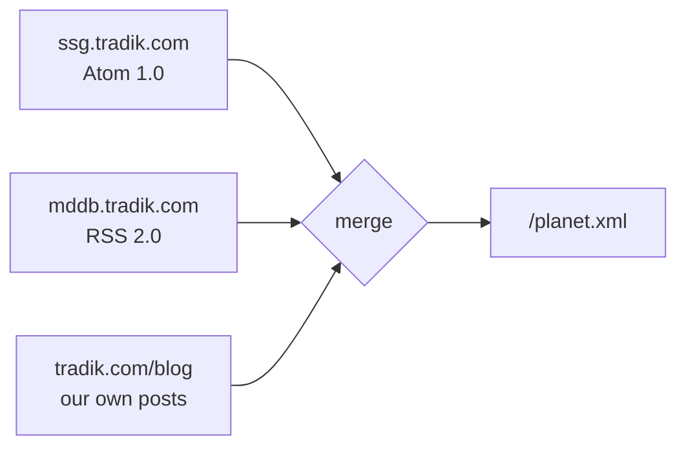

We publish in more than one place. SSG has its own site with its own blog. MDDB
has another. Then there is tradik.com, which is where someone actually lands when
they want to know what we have been doing — and which, until this week, knew
nothing about either.

The fix sounds trivial: read two feeds, print the entries. It is trivial, right
up to the moment you try it, and then four questions show up that a "just merge
them" answer does not survive.

## The shape of the thing



Note the third input. It is the one most aggregators leave out, and leaving it
out is what makes an aggregate feel like a link dump instead of a section of your
own site. **A planet without you is not your planet.**

Here is the whole configuration:

```yaml
external_sources:
  sources:
    ssg:  { type: http, url: https://ssg.tradik.com/feed.xml,  format: feed }
    mddb: { type: http, url: https://mddb.tradik.com/feed.xml, format: feed }

feeds:
  - path: /planet.xml
    title: "Planet Tradik"
    format: rss
    aggregate:
      - source: ssg
        label: "SSG"
      - source: mddb
        label: "MDDB"
      - site: blog
        label: "Tradik"
    exclude:
      words: [sponsored]
    items: 200
    paginate: 20
```

That is the boring part. The rest of this is the four decisions.

## 1. Whose format wins?

SSG publishes Atom. MDDB publishes RSS 2.0. Both describe the same thing —
entries with a title, a link and a date — and both put those in different places:

| | Atom | RSS 2.0 |
|---|---|---|
| entries live at | `.feed.entry` | `.rss.channel.item` |
| the link is | an attribute, `<link href="…"/>` | element text, `<link>…</link>` |
| the date is | RFC 3339 | RFC 1123Z |

You can already fetch either as generic XML, which is what we did before. The
problem is that the template then has to know which one it is reading, and the
day a source switches format — or you add a third that speaks JSON Feed — the
template breaks over content that has not changed at all.

So `format: feed` normalizes all three into one shape, and **detects the format
from the payload rather than from the declaration**. That last part matters more
than it sounds: a URL ending in `.xml` tells you nothing about whether it is Atom
or RSS, and a redirect can hand you something different from what you asked for.
Trusting the file extension is trusting the wrong thing.

Dates get parsed into real timestamps rather than left as strings. That sounds
like tidiness and is actually load-bearing: **without comparable dates you cannot
sort items from different feeds against each other**, and without that there is
no merge — only two lists printed one after the other.

### The bug that only RSS could show

The first version worked perfectly on Atom and silently dropped every RSS entry.

Go's XML decoder has an `AutoClose` option, and the obvious value to hand it is
`xml.HTMLAutoClose` — be liberal, real feeds are messy. That list contains
`link`, because in HTML `<link>` is a void element. In RSS, `<link>` is not void:
it is where the entry's URL lives, as text. The decoder closed the tag
immediately, the URL vanished, and the malformed `<item>` went with it.

Atom was unaffected, because Atom's `<link href="…"/>` genuinely is empty.

I caught it because the test corpus had both formats in one aggregate and the
count came back 2 when it should have been 3. Had I tested the formats
separately — each in its own fixture, each passing — it would have shipped, and
it would have looked like "RSS support is broken for some sites" rather than one
wrong constant.

## 2. What do you drop, and where?

A merged feed inherits everybody's noise. One source posts release notes among
conference write-ups. Another tags things you do not want republished. And some
things you never want, whatever the origin.

So filtering happens at two levels, and the order is deliberate:

```yaml
aggregate:
  - source: mddb
    exclude:
      tags: [events]      # this source only
exclude:
  words: [sponsored]      # the whole feed
```

**Per source first, then feed-wide.** What counts as noise depends on the feed it
came from, and that context is destroyed the moment everything is in one list.
A single rule for the whole aggregate has to be either loose enough to let one
source's noise through, or tight enough to cut wanted posts from the quieter ones.

Exclusion beats inclusion when both match. A feed republishing other people's
writing needs to be able to say "not this" with certainty, and an item matching
both lists is far more likely to be the thing you were trying to remove.

Words match the title and summary, not the full body — a passing mention of a
sponsor deep inside an otherwise good article should not delete the article.

## 3. Where did this come from?

Once things are mixed, "which site is this from" is the first question both a
reader and a template ask — and it is unrecoverable afterwards. You cannot infer
it from the URL without hardcoding domains, and you certainly cannot infer it
once someone links across sites.

So the label is attached at collection time and travels with the item into the
output as a category:

```xml
<item>
  <title>Markdown as a database</title>
  <category>database</category>
  <category>MDDB</category>
</item>
```

Now the feed can be grouped by source, a template can badge each entry, and a
reader that supports category filtering can subscribe to one project's items out
of the combined feed.

## 4. What happens when a source goes dark?

Sooner or later one of the feeds 404s, times out, or returns HTML from a captive
portal. The question is what your build does about it.

It warns and carries on. A build failing because *somebody else's* site is down
would be the wrong trade: you would be unable to publish your own writing because
a third party had an outage. So an unreachable or unparseable source is skipped
with a message naming it, and the planet is published without that source's
items until it comes back.

The same applies to a source declared without `format: feed` — it warns rather
than mixing unnormalised data into the output.

## The smaller decisions

**Deduplication by URL.** The same post can arrive twice — through a project's
own feed and through something that already aggregates it. Publishing it twice is
the single most visible way an aggregate looks broken, so first occurrence wins.

**Pagination that does not move.** With `paginate: 20`, the archive splits across
pages linked with RFC 5005 `rel="next"` and `rel="prev"`, so a reader can walk
backwards through the whole thing rather than seeing only the newest slice. Page
one keeps the declared path — `/planet.xml`, never `/planet-1.xml` — because the
URL people already put in their reader must not shift as the archive grows.

**Two separate knobs for size.** `items` is how many entries the feed carries at
all; `paginate` is how many go on a page. They are different questions and
conflating them into one number makes the second one unanswerable.

## What it cost

One config block, and the parts above that are worth knowing. The output is a
single RSS feed that a reader subscribes to once and gets everything we publish,
wherever we publish it — with each entry labelled, the noise filtered, and our
own posts sitting in the same stream rather than in a separate place nobody
checks.

The pieces are all in [external sources](/external_sources/) and
[configuration](/configuration/). `format: feed` reads; `feeds:` with
`aggregate:` merges. Everything else here is a consequence of those two.
