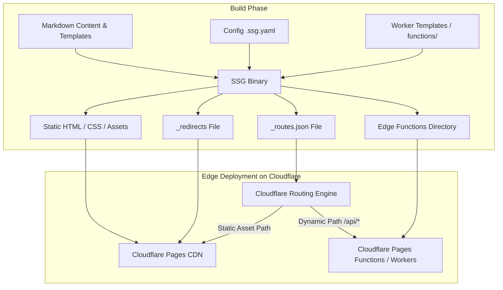
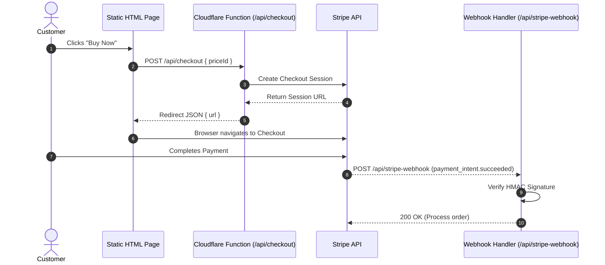

Web sites usually fall into two traps. Either they start out static and get rewritten into heavy SSR frameworks the moment marketing asks for a Stripe payment button, or they launch as a massive Node server just to render text and images that change twice a week.

Neither approach feels right. Static sites are unbeatable for speed, cost, and resilience: when your content is pre-baked HTML on an edge CDN, there is no database to crash, no cold boot delay, and no monthly server bill. But real business sites still need transactions: forms, subscriptions, webhook handlers, and path migrations.

With SSG 1.8.11, the boundary is explicit: **static for content, edge functions for transactions**. You get pure static HTML by default, plus zero-latency Cloudflare redirects and edge Functions when you need them—without turning your build pipeline into a complex node stack.

Here is how the integration works, how SSG handles redirects, and how to build a complete Stripe Checkout flow in under 5 minutes.

---

## High-Level Architecture

SSG compiles your Markdown and templates into static assets (`output/`), while generating Cloudflare control files (`_redirects` and `_routes.json`) and outputting your edge handlers.



Because `_routes.json` explicitly instructs Cloudflare which paths hit a Function (`/api/*`), 99% of your traffic bypasses Worker execution entirely. You pay zero worker invocation costs for static content visits.

---

## The Redirects Engine: Zero-Hop Flattening

Redirects are where SEO goes to die if managed poorly. When migrating sites or restructuring URLs, chained redirects (`/old-page` → `/interim-page` → `/new-page`) incur severe latency penalties and SEO degradation.

SSG's redirect engine solves this at build time by reading `redirects:` blocks and frontmatter `aliases:`, validating paths, and **flattening redirect chains automatically**.

```yaml
# .ssg.yaml
redirects:
  - from: /old-pricing
    to: /pricing
    status: 301
  - from: /blog/*
    to: /articles/:splat
    status: 301
  - from: /discontinued-product
    to: /products
    status: 410
```

If `/old-pricing` points to `/pricing`, and frontmatter on a new page sets `aliases: [/pricing]`, SSG resolves `A → B → C` into two direct rules: `A → C` and `B → C`. Visitors and search bots take exactly one hop.

### Migrating from Next.js?

If you are migrating off Next.js, you don't need to rewrite your redirect rules by hand. Run:

```bash
ssg import redirects next.config.ts
```

Or pass a JSON dump from `next.config.js`:

```bash
ssg import redirects --from-json redirects.json
```

SSG translates Next.js wildcard syntax (`/:slug*`) into standard `_redirects` splats (`/*` → `:splat`), maps permanent flags to HTTP status codes, and warns you about any un-convertible regex constraints.

---

## Wiring Edge Workers & Pages Functions

Adding dynamic endpoints to an SSG site requires adding a `worker:` section to your `.ssg.yaml`:

```yaml
worker:
  dir: workers/stripe-checkout
  mode: functions
  routes_include:
    - /api/*
```

When you run `ssg`, it packages the static files and wires the `functions/` directory for deployment. During local development:

```bash
ssg --config .ssg.yaml --http --watch
```

SSG automatically boots `wrangler dev` side-by-side with its static preview server. You get live reload on static pages and instant hot-reload on edge API routes.

---

## Step-by-Step: Adding Stripe Checkout & Webhooks

Let's walk through building a production-ready Stripe Checkout flow using the scaffolded worker template.

### 1. Flow Overview



### 2. Scaffold the Worker Template

Run the built-in generator:

```bash
ssg new worker stripe-checkout
```

This creates a lightweight, zero-dependency Pages Functions structure under `workers/stripe-checkout/functions/api/`:

- `checkout.ts`: Handles session creation.
- `stripe-webhook.ts`: Validates cryptographically signed Webhook events from Stripe.

### 3. The Edge Function Code

Here is the clean, dependency-free checkout handler (`checkout.ts`):

```typescript
export async function onRequestPost(context) {
  const { request, env } = context;
  const { priceId } = await request.json();

  if (!priceId) {
    return new Response(JSON.stringify({ error: 'Missing priceId' }), { status: 400 });
  }

  // Call Stripe REST API directly using fetch (no heavy SDK needed on the edge)
  const params = new URLSearchParams({
    'mode': 'payment',
    'success_url': `${env.SITE_URL}/success?session_id={CHECKOUT_SESSION_ID}`,
    'cancel_url': `${env.SITE_URL}/pricing`,
    'line_items[0][price]': priceId,
    'line_items[0][quantity]': '1',
  });

  const stripeRes = await fetch('https://api.stripe.com/v1/checkout/sessions', {
    method: 'POST',
    headers: {
      'Authorization': `Bearer ${env.STRIPE_SECRET_KEY}`,
      'Content-Type': 'application/x-www-form-urlencoded',
    },
    body: params.toString(),
  });

  const data = await stripeRes.json();
  if (!stripeRes.ok) {
    return new Response(JSON.stringify({ error: data.error?.message }), { status: 500 });
  }

  return new Response(JSON.stringify({ url: data.url }), {
    headers: { 'Content-Type': 'application/json' },
  });
}
```

### 4. Front-End Integration

On your static product or pricing page (`content/pages/pricing.md` or template):

```html
<button id="buy-btn" data-price="price_1NXXXXXXXXXXXXX">Buy Product ($29)</button>

<script>
document.getElementById('buy-btn').addEventListener('click', async (e) => {
  const priceId = e.target.getAttribute('data-price');
  
  const res = await fetch('/api/checkout', {
    method: 'POST',
    headers: { 'Content-Type': 'application/json' },
    body: JSON.stringify({ priceId }),
  });
  
  const data = await res.json();
  if (data.url) {
    window.location.href = data.url;
  } else {
    alert('Payment initialization failed: ' + data.error);
  }
});
</script>
```

### 5. Configuring Secrets & Deploying

Store your Stripe API credentials securely on Cloudflare (never put keys in `.ssg.yaml` or Git):

```bash
wrangler pages secret put STRIPE_SECRET_KEY
wrangler pages secret put STRIPE_WEBHOOK_SECRET
```

Finally, build and deploy the entire application with one command:

```bash
ssg --config .ssg.yaml --deploy cloudflare --deploy-project my-storefront
```

SSG compiles your static content, constructs `_redirects` and `_routes.json`, uploads static assets, and deploys your Pages Functions via Cloudflare's edge pipeline.

---

## Conclusion

Building modern web applications doesn't require choosing between static speed and dynamic capabilties. By pairing SSG with Cloudflare Pages Functions:

1. **Content remains static**: Ultra-fast, zero maintenance, cacheable at the edge.
2. **Redirects stay clean**: Chain flattening ensures zero extra hops or SEO penalties.
3. **Transactions run on the edge**: Lightweight serverless functions handle payments and APIs without a full-blown application server.

Keep your static sites fast, simple, and pragmatic.
