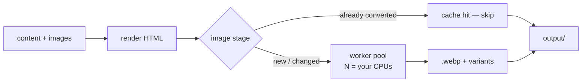
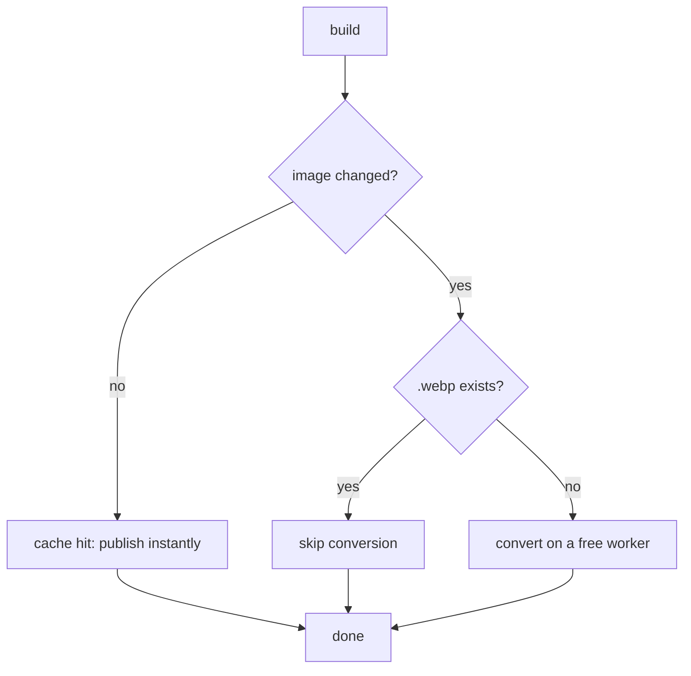

Here is a confession. Until this release, an SSG build did everything **one thing
at a time**. Convert an image, then the next, then the next. On a text-only site
you never notice — the whole thing is over before your terminal repaints. On a
site with three hundred photos and WebP turned on, you notice a lot, because
`cwebp` is not fast and there were 300 of them standing in a single-file queue
while eleven of your twelve CPU cores watched.

That queue is gone. And once I was in the image pipeline making it parallel, I
realised three *other* things in there have been quietly saving you time for
releases — and none of them were ever documented. So this is one post about a new
feature and three you already had.

## The new part: `--workers`

Page/post rendering **and** WebP conversion now run on a worker pool. Each output
is independent — a page renders to its own file, an image gets its own `.webp` —
so there is nothing to coordinate and nothing to get wrong. Point it at your
cores:

```bash
ssg my-site simple example.com --webp            # one worker per CPU (default)
ssg my-site simple example.com --webp --workers=2 # cap it — shared build box
ssg my-site simple example.com --webp --workers=0 # off, back to sequential
```

The semantics are the boring, obvious ones: leave it alone and it uses the whole
machine; write a number and you get exactly that many; write `0` and parallelism
is **off**. The output is byte-for-byte identical no matter what you pick — the
worker count changes the wall-clock, never the bytes. That's not a hope, it's
checked: the conversion runs under Go's race detector in CI, and a golden-snapshot
harness fails the build if a single output byte moves.



## The parts you already had

### 1. Convert once, then never again

The image processor keys every result on a **content hash of the source bytes
plus the exact operations** you asked for. Resize a photo to 800px once, and the
next build finds that exact result in the cache and publishes it without touching
`cwebp` at all. Change the source photo, or change the width, and the key changes,
so it re-runs — but *only* for the thing that actually changed. It's a
content-addressed cache with atomic publishing, and it means the expensive second
build after a one-word typo fix costs almost nothing.

### 2. WebP skips what's done

Related but separate: the WebP pass checks whether the `.webp` already exists next
to (or in place of) the original and skips it unless you pass `--reconvert-images`.
So the parallel worker pool above usually has far less to do than you'd think — on
an incremental build it's mostly confirming that yesterday's conversions are still
there. Parallelism and "don't redo it" compound: fewer images to convert, and the
few that remain converted at once.

### 3. `--watch` doesn't rebuild on a whim

When you run with `--watch`, SSG doesn't rebuild just because an editor touched a
file's modified-time. It keeps a **content signature** of the watched tree and
only rebuilds when the *bytes* actually change. Save a file with no edits, or let
a tool bump every mtime, and nothing happens — the signature is identical, so the
build stays put. It's the difference between a watch loop that helps and one that
thrashes.

## Why this order matters

Put together, the image stage now does the least work possible and does what
remains in parallel:



None of this changes the deal SSG makes anywhere else: the output is
deterministic, the features are opt-in, and it's still one Go binary with no
`node_modules`. It just spends your CPU cores instead of making them wait in line
— and, as it turns out, it was already spending them carefully. We just never
said so out loud.

**Update:** HTML rendering is parallel now too. Images were the isolated first
win; the render loop was the harder one, because it threads a mutable "current
language" through the template context. The fix was to stop mutating that state
per page: pages are grouped by language, the shared site view is set **once** per
language, and then that language's pages render together on the pool. The
render-time caches (the markdown-conversion memo, shortcode templates, the
missing-translation warnings) are now guarded, with the expensive markdown
conversion happening *outside* the lock so it still parallelises. Same proof as
the images: byte-for-byte identical output under the race detector and the golden
harness — on a real site here, `--workers=8` roughly halved the build. `--workers`
now governs both stages; `0` still turns it all off.
