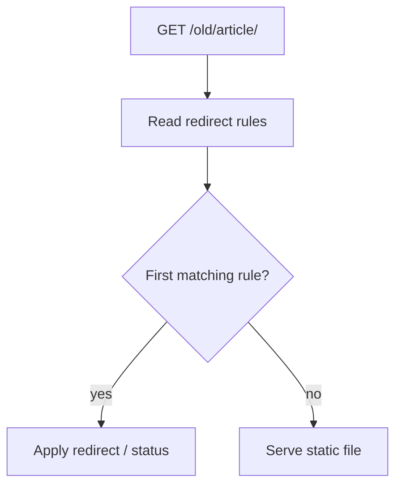
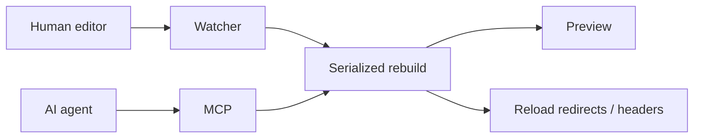

Some bugs appear only after deployment even though the generated files are
identical. The difference is the server around them.

That used to be true for SSG's local preview in a few important places. The
build generated `_redirects` and `_headers` for platforms such as Cloudflare
Pages and Netlify, but the built-in server did not read them.

So this:

```text
/old-page/  /new-page/  301
```

worked after deployment.

Locally:

```text
GET /old-page/
404
```

The preview served the generated files, but not the routing behaviour used in
production.

## Static sites still have server behaviour

"Static" is often interpreted as "a directory full of files", but visitors also
observe the server behaviour around those files:

```text
redirects
headers
cache rules
404 behaviour
410 responses
rewrites
custom endpoints
```

The same `index.html` behind two configurations can behave differently.

This matters particularly after migrations.

The new site's internal navigation points at the new URLs. You can spend an hour
clicking around locally and never exercise a single redirect.

Search crawlers and external links continue to use URLs collected from the old
site.

## The invisible 404 problem

Suppose WordPress used:

```text
/articles/old-slug/
```

and the static site uses:

```text
/blog/new-slug/
```

The generated redirect is correct:

```text
/articles/old-slug/ /blog/new-slug/ 301
```

Your local homepage works.

The new article works.

Every test performed by navigating from the homepage works.

Then you deploy.

Only now do you discover whether the redirect syntax is valid, whether ordering
does what you expected and whether another rule shadows it.

That is a bad place to run the first integration test.

The development server now evaluates `_redirects` itself.

For the subset written by SSG, the preview follows the relevant Cloudflare Pages
rules: order matters, the first matching source wins, redirects are evaluated
before static assets, and splats and placeholders work. It accepts `301`, `302`,
`303`, `307`, `308` and `410`; Cloudflare Pages supports the five 3xx codes but
not `410`, so a Cloudflare-targeted build warns when that status is used.



This moves the first redirect check from deployment to the local machine.

## Headers are part of the page too

Redirects are obvious because the browser moves somewhere.

Headers fail more quietly.

A site might generate rules for:

```text
Content-Security-Policy
Cache-Control
X-Content-Type-Options
Referrer-Policy
```

If local preview ignores them, you are not testing the security and caching
configuration that will actually wrap the site.

SSG now reads `_headers` as well. When a path matches a rule, the preview applies
its headers, with the first matching value winning for each header name. Values
from the file override the server's own defaults.

That precedence is necessary to preview the deployed configuration rather than
silently replacing it with local defaults.

## Then caching made the preview too accurate

Once the preview started honouring `_headers`, it also started honouring the
site's caching rules.

Which may include something like:

```text
/css/*
  Cache-Control: public, max-age=31536000, immutable
```

That policy suits fingerprinted production assets but not a `style.css` file
being edited in place.

The browser quite reasonably sees `immutable` and keeps the old stylesheet.
Live reload fires, the HTML refreshes, and the CSS looks exactly as it did before
you changed it.

The result resembles a failed build even though the browser is obeying the
production cache policy.

Development preview therefore needs one deliberate difference from production:
**development responses must not be sticky**.

When watch mode or the MCP HTTP preview is active, SSG forces `no-cache` and
removes conditional request state that could return an old asset.

Published output keeps its configured cache policy. In preview mode the server
drops `If-None-Match` and `If-Modified-Since`, so the file handler returns the
current asset instead of accepting a validator from an earlier build.

Parity does not mean copying a production optimisation that prevents you from
seeing your edits.

## One process is easier to reason about than two

The watcher, MCP server and HTTP preview could previously run as separate
processes. That makes it easy to end up with two processes
building the same output directory or one process not noticing a change made
through another path.

Now this can be one command:

```bash
ssg mcp --http --watch --listen=7823
```

One process owns the filesystem watch, MCP mutations, rebuilds and preview.



An editor change or MCP mutation now enters the same rebuild path. A watched
configuration change reloads the build configuration and live endpoint table;
the MCP roles and writable directories remain fixed until restart.

There is one output tree, and a mutex serializes rebuilds from the watcher and
concurrent MCP requests.

## A preview has one job

Development servers accumulate useful extras such as live reload, error pages,
request logging and debug endpoints. Their primary contract is simpler:

> Show me what I am about to deploy.

If a redirect works in production, I want to exercise it locally.

If a header will be present in production, I want to inspect it locally.

If a configuration change alters an endpoint, I want the running preview to
notice.

And if I change a stylesheet, I want the browser to show the new stylesheet
rather than faithfully preserving last year's production cache policy.

The local server does not imitate every implementation detail of a CDN. It makes
the generated redirect and header behaviour testable before deployment, while
keeping edited assets fresh.
