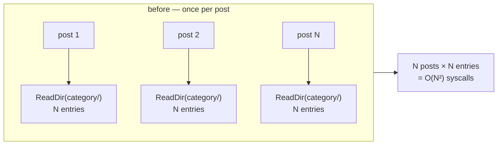
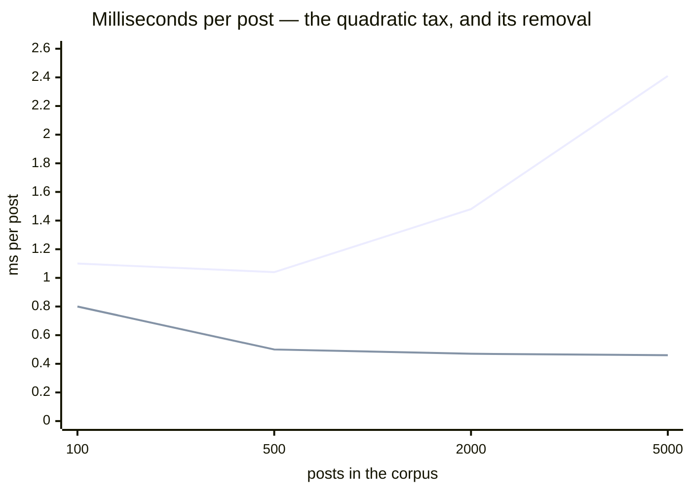

The question was simple: how do we make publishing faster? My instincts fired off
the usual list — better caching, tighter memory layout, maybe some CPU
architecture tricks. Profile-guided optimization. A RAM disk, even.

Every one of those instincts was wrong, and the profiler took about ninety
seconds to say so.

## First, something worth measuring

A real docs site here is 24 Markdown files. It builds in under a second, which
means it can't tell you anything: at that size the numbers are noise, and a cost
that grows with the size of your site is completely invisible.

So the first piece of work wasn't optimization at all — it was a corpus. A
generator that writes realistic posts (frontmatter, prose, headings, a code
fence, tags) at 100, 500, 2000 and 5000 posts, with a fixed random seed so every
run is comparable. That's `make bench` now, because a performance claim you can't
re-run is just a nice story.

With something to measure, I profiled the 2000-post build. Here's what came back:

```
  flat  flat%   cum   cum%
 3.51s 65.98%  3.51s 65.98%  syscall.rawsyscalln
```

**Sixty-six percent of the build was syscalls.** Not markdown parsing, not
template rendering, not anything a smarter instruction set would touch. The build
was I/O-bound, and every CPU trick on my list was aimed at the 34% that wasn't
the problem.

## Where the syscalls came from

One more level down and the profile stopped being ambiguous:

```
   4.00s 75.19%  generator.generatePost
   3.59s 67.48%  generator.copyColocatedAssets
   3.59s 67.48%  os.ReadDir
```

A single function, `copyColocatedAssets`, was **two thirds of the entire build**,
and all of it was `os.ReadDir`.

The reason is a shape worth recognising, because it hides well. A post's source
directory is its whole *category* directory — the folder it shares with all its
siblings. The function listed that directory to find images sitting next to the
post. Reasonable. But it ran per post:



With 2000 posts in one directory that's 2000 listings of a 2000-entry directory —
four million directory entries read, to answer a question whose answer never
changes during a build.

What makes it sneaky is that this code had *already been optimized*. A previous
pass had noticed the copying was quadratic and fixed exactly that: only copy
assets the page actually references. It fixed the writes and left the listing.
The remaining cost stayed invisible until a corpus was big enough to make it the
whole build.

The fix is boring, which is how you know it's the right one: read each directory
once, remember it. It's immutable for the duration of a build, and every post in
the category can share the same answer. A mutex keeps it honest under parallel
rendering.

**2000 posts: 2.96s → 1.74s.**

## Then the profiler moved the goalposts

Re-profiling after a fix is not optional, because fixing the biggest cost
promotes something else to biggest cost. And the new leader was a genuine
surprise:

```
   0.77s 48.12%  models.ComputeReadingStats
   0.72s 45.00%  regexp.ReplaceAllString
```

**Forty-eight percent of the build was computing reading time.** That little
"5 min read" label at the top of a post.

The implementation looked entirely innocent:

```go
text := markupStripRe.ReplaceAllString(p.Content, " ")
words := len(strings.Fields(text))
```

Strip the markup, count the words. Two lines, obviously correct, and it does the
following for every page: runs a regex engine across the entire document,
allocates a complete second copy of it with markup blanked out, then walks that
copy again to split it, allocating a slice of every word — all to produce a
single integer that gets divided by 200.

You don't need any of that. You need to walk the text once and count the
transitions from space to non-space, skipping markup as you go. No regex engine,
no copies, nothing allocated:

```
BenchmarkCountProseWords        33700 ns/op    243.91 MB/s      0 B/op    0 allocs/op
BenchmarkCountProseWordsRegex  261587 ns/op     31.42 MB/s  47398 B/op   15 allocs/op
```

**7.8x faster, and 47KB per page that no longer needs allocating or collecting.**

The obvious risk with hand-rolling something a regex was doing is that you get an
edge case wrong and quietly miscount words on pages nobody checks. So the regex
stayed in the codebase — not as code that runs, but as the *specification*. A
test runs both implementations over the awkward shapes (unterminated tags,
`{{` without `}}`, brackets that aren't shortcodes, emoji, non-breaking spaces)
and then over 4000 randomly generated pieces of markup soup, and fails if they
ever disagree.

**2000 posts: 1.74s → 0.99s.**

## The numbers

Best of three runs on an M2, same corpus, same output — the generated site is
byte-for-byte identical before and after, which the golden-file harness checks on
four separate corpora.

| Posts | Before | After | Faster |
|---:|---:|---:|---:|
| 100 | 0.11s | 0.08s | 1.38x |
| 500 | 0.52s | 0.25s | 2.08x |
| 2 000 | 2.96s | 0.95s | 3.12x |
| 5 000 | 12.07s | 2.30s | **5.25x** |

The speedup grows with the corpus, which is the tell that something algorithmic
changed rather than something merely constant. Look at the cost *per post* and it
becomes obvious:



The upper line is the old build: each post got steadily *more expensive* as the
site grew, from 1.10ms to 2.41ms. That's the quadratic term becoming visible. The
lower line is flat at roughly 0.46ms whether you have 500 posts or 5000. Publishing
now costs what it should: a fixed price per page.

## The tricks that didn't work

This is the part I'd want to read, so here it is honestly.

**A RAM disk bought 8%.** I built a 512MB RAM disk, copied the corpus onto it and
rebuilt: 1.04s → 0.96s. Barely worth the setup, and the reason is that your
operating system already did it. Files you just read are sitting in the page
cache; a warm build is *already* reading from RAM. A RAM disk mostly helps with
writes and with genuinely cold data, and a build of this shape has little of
either.

**Profile-guided optimization bought nothing.** Go can take a CPU profile and use
it to guide inlining and layout decisions, which is a lovely feature and
frequently worth single-digit percentages. Here: 0.96s before, 0.96s after —
no measurable difference. Once the pathological costs were gone, the remaining
time was spread across syscalls and library code, with no hot inlinable loop left
for PGO to sharpen.

**And the CPU architecture tricks never got their turn**, because after both
fixes the profile reads:

```
   880ms 74.58%  syscall.rawsyscalln
```

75% syscalls again — but this time it's honest work: reading 5000 source files
and writing 5100 HTML pages. You can't SIMD your way out of writing files. Going
further would mean changing *what* gets written, not how fast the CPU thinks
about it.

## What I'd take from this

Not "profile before optimizing" — everyone says that and it's too vague to act
on. Three sharper things:

**Build the big corpus first.** Both bugs were invisible at 24 pages and obvious
at 2000. If your benchmark can't grow, it can't find anything that grows.

**Re-profile after every fix.** The reading-time regex was 15% of the original
build — real, but not remarkable. It only became the obvious next target once the
directory scan stopped hiding it. Optimization is a sequence of "what's the
biggest thing now", and you can't answer that from memory.

**Watch for the half-finished fix.** The most expensive line in the whole build
sat inside a function that had already been optimized once, with a comment
explaining the quadratic behaviour it had removed. It removed the quadratic
*writes*. The quadratic *reads* went right on running underneath. When you find a
performance comment, check whether it fixed the whole problem or just the part
that was visible that day.

Everything here is reproducible: `make bench` generates the corpora and reports
the numbers on your own hardware. I'd genuinely like to know what it says on
something that isn't an M2.
