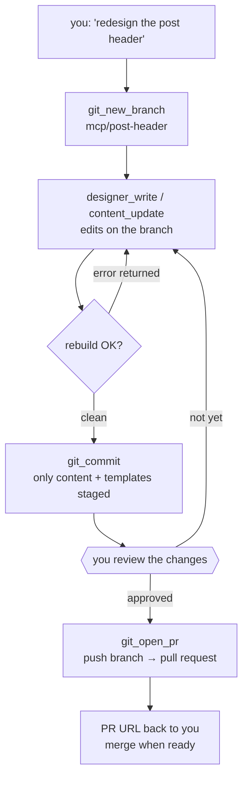

Here's a workflow that used to require careful copy-pasting: you tell an AI
assistant "make the hero section two-column and move the tag list under the
title", it suggests a diff, you apply it, you rebuild, it's broken, you paste the
error back, repeat. The assistant was never actually *in* the project — it was
shouting suggestions through a wall.

`ssg mcp` (new in 1.8.16) removes the wall. It's a development server speaking the
Model Context Protocol — the standard AI assistants use to work with tools — and
it gives the assistant *two roles with real boundaries*.

## Two coworkers, two contracts

- The **designer** changes how the site *looks*. It can list, read and write
  templates, partials, CSS and theme assets — and set the *presentation* keys in
  your config (theme, syntax-highlight style, diagrams, minification), because
  that's where half of "how it looks" actually lives. It cannot touch your
  content, cannot delete files, cannot write outside the template directories,
  and cannot change any other config key: secrets, deployment, server settings
  and URL structure are all refused. Comments in your config survive the edit,
  and a change that breaks the config is rolled back automatically.
- The **content manager** changes what the site *says*. It can list, read,
  create, update and delete Markdown — frontmatter and body. It cannot touch
  templates, and it can only write Markdown.

The boundaries aren't a suggestion in a README the model never reads. Every tool
description states the CAN and CANNOT explicitly, a `help` tool restates the
whole contract on demand, and the server enforces it — a designer write into
`content/` is rejected, path traversal is rejected, a content write of anything
but `.md` is rejected.

So when you say *"the post header feels cramped — give it more air and drop the
category badge"*, the designer edits the template. When you say *"we renamed the
product, fix it across all posts and unpublish the old announcement"*, the
content manager does exactly that — and nothing else.

## Every change proves itself

By default `ssg mcp` rebuilds the site after each successful edit. That closes
the loop that made the copy-paste workflow so tedious:

- The change builds cleanly → the assistant is told so and moves on. Your
  browser, pointed at the dev server, already shows the result.
- The change breaks a template → the build error comes back *as the tool
  result*, flagged "the site did NOT rebuild — fix this before continuing". The
  assistant repairs its own mistake before you ever see it.

Prefer edits without rebuilds? `--no-watch`. Want only one role active — say,
content editing with the theme locked? `--role=content`.

## Nothing ships without you

The part that makes this safe for real repositories: the optional git flow.
Configure an account and a token (from the environment, never a literal):

```yaml
mcp:
  git:
    account: you
    token: $GITHUB_TOKEN
    default_branch: main
```

and the assistant gains three more tools — with a hard rule built in:



Edits never land on the base branch — the work starts with `git_new_branch`.
Commits stage only the content and template directories, so build output never
sneaks in. And `git_open_pr` is documented to the model as *the final,
human-approved step*: it pushes the branch and opens the pull request only after
you've reviewed the work and said so. If you're on the base branch, the server
refuses the PR outright. No token configured? The `git_*` tools simply don't
exist, and version control stays entirely in your hands.

## Wiring it up

Register SSG as a stdio server in any MCP-capable assistant:

```json
{ "command": "ssg", "args": ["mcp", "--config", ".ssg.yaml"] }
```

Then talk to it like you'd talk to a coworker: *"designer — lighter header,
serif for headings"*, *"content — draft a changelog post for 1.8.16 from these
notes and mark it draft"*. The roles keep the blast radius small, the rebuild
keeps the feedback honest, and the PR gate keeps the ship date yours.

That's the whole idea: the assistant gets hands, you keep the keys.
