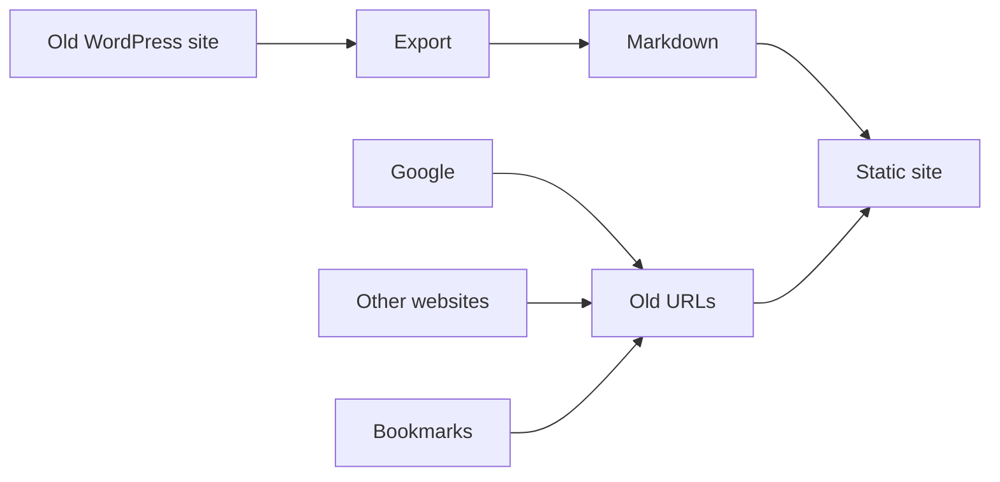

A WordPress migration looks simple from a distance: export the posts, convert
them to Markdown, generate HTML and deploy. That description leaves out the
twelve years the old site may have spent online.

Search engines know its URLs, other sites link to them and readers have
bookmarks. Some posts live three categories deep; navigation, date archives and
comments all sit outside the post body.

Content is only the visible part of the migration. The difficult part is
preserving what readers and other sites already depend on.

## A successful build can still be a broken migration

Imagine a converter receives this WordPress URL:

```text
/2019/06/building-a-static-site/
```

but discards it and publishes the post at:

```text
/blog/building-a-static-site/
```

The new page may render perfectly and score well in Lighthouse, while every
existing link to the article returns a 404.

From inside the new site everything looks correct. From outside it is broken.

That is what makes migration bugs unpleasant: many of them are invisible if you
only click around the new site.



The top half of that diagram is file conversion. Preserving the paths used by
the bottom half is the migration work.

## URLs are already public API

Developers are comfortable treating an API endpoint as a contract.

Change:

```text
/api/v1/customer/42
```

without compatibility and somebody's integration breaks.

A published URL deserves much the same treatment.

Once `/category/linux/server/post-name/` has been indexed, shared, emailed and
linked from another site, it no longer belongs entirely to your application.

The export used by `ssg migrate wordpress` carries each page's original `link:`
into frontmatter, and the generator uses that path. A normal migration therefore
keeps the post URL instead of redirecting it. If you deliberately replace that
path, record the former URL in frontmatter `aliases:` or in the `redirects:`
configuration; the build then writes the corresponding rule to `_redirects`.

## WordPress has more structure than posts and pages

A basic migration script often recognises only two types:

```text
post
page
```

Real installations also contain custom post types, sticky posts, nested
categories, menus, comments, category and date archives, and pagination.

Sometimes language information belongs to a directory because a multilingual
plugin managed it, rather than appearing as metadata on every post.

These are ordinary WordPress structures, but they are easy to miss after an
export has flattened the application into a pile of files.

The importer's objective is not merely:

> Turn WordPress XML into Markdown.

It is better stated as:

> Reconstruct enough of the old site's behaviour that replacing WordPress does
> not unexpectedly replace the site.

## Categories are a good example

A category can look trivial in an export:

```text
Engineering
```

But on the site it may actually be:

```text
/notes/engineering/
```

or:

```text
/category/company/engineering/
```

or part of a hierarchy:

```text
/category/development/go/
```

Flatten the hierarchy and you have changed URLs.

Reconstruct the hierarchy incorrectly and the URLs still change.

The Markdown file containing a post cannot tell you all of this by itself.
Migration needs to understand the taxonomy as a structure, not merely copy the
category names into frontmatter.

The same applies to menus. A navigation menu is not content inside a page, but
users certainly notice when it disappears.

## Old archives still receive traffic

Few greenfield static sites begin with a requirement for monthly archives from
June 2014. A migration is different.

If the WordPress site exposed:

```text
/2014/06/
```

for twelve years, there is a reasonable chance that URL exists in a search
index, analytics report, external link or someone's bookmarks.

Date archives and category archives are exactly the kind of feature that feels
safe to delete because nobody on the migration team personally uses it.

That is not evidence that nobody uses it.

SSG migrations enable date archives and preserve category archive paths from
the export. They can also rebuild custom-post-type archives when wpexporter
1.8.15 or newer records WordPress's `has_archive` value. Those surfaces are
reconstructed from source metadata rather than inferred from the Markdown body.

## Comments are content too

Comments are awkward in static publishing because they originally belonged to a
database-backed application, but that does not make them disposable.

A ten-year-old technical article may have corrections, alternatives and useful
discussion below it. Sometimes the most valuable sentence on the page was not
written by the author.

A migration that preserves the article and silently drops that discussion has
not migrated the whole document readers were using.

There are legitimate reasons to leave comments behind. It should be a decision,
not an accidental consequence of choosing a static generator. SSG's WordPress
migration can export approved comments into `comments.json`; unapproved and
spam comments are not exposed by the anonymous REST response it consumes.

## Multilingual migrations expose another hidden assumption

A bilingual WordPress installation may encode language through a plugin and URL
structure:

```text
/de/produkte/
/fr/produits/
```

The exported Markdown may not contain:

```yaml
lang: de
```

on every document.

Writing that field manually into hundreds of files works exactly until the next
export overwrites them.

SSG's `language_sections` lets the migration describe the structure once:

```yaml
language_sections:
  de: de
  fr: fr
  home: en
```

Resolution follows the documented order: an explicit page language, the
longest matching section and finally the site's default language.

That order matters because migrations are not necessarily one-time events.
During a transition, you may export the source repeatedly while the old CMS is
still receiving content.

Anything requiring a manual repair after every export is a recurring chore, not
part of the migration pipeline.

## Preview the old URLs, not just the new pages

There is one test I now consider essential after a migration.

Do not begin at `/`.

Begin with the old URLs.

Take them from analytics, the sitemap, a crawler or the WordPress database and
request them against the new site.

```text
old post URL       → 200 or redirect → 200
old category URL   → 200 or redirect → 200
old archive URL    → 200 or redirect → 200
deleted content    → intentional 404 or provider-supported 410
```

This was difficult to test locally when the development server did not interpret
the generated `_redirects` file. The deployment platform knew the redirects;
the preview did not.

That gap is now closed in SSG: the built-in server understands the redirect
rules the build generates.

A migration should not need production traffic to discover whether its old URLs
work.

## Static is the destination, not the excuse

Moving from WordPress to static output removes the PHP request path and database
query required to serve an article, leaving less application surface to
maintain. Those are good reasons to migrate, but not reasons to ignore useful
behaviour from the old application.

The useful question is not:

> Did all 3,842 posts become Markdown?

It is:

> Can somebody who knew the old site continue using the new one without knowing
> we replaced the engine underneath it?

When the answer is yes, the migration is finished.
