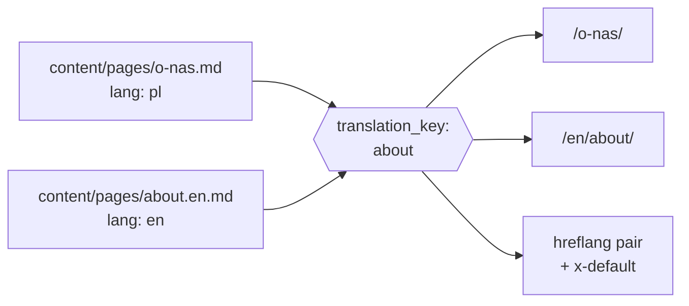

SSG has had multilingual builds for a while and I have never written a word
about them, which is a shame, because the interesting part is not the feature
list. It is that a translated site breaks an assumption every static generator
starts from: **that a page is a file**.

Once a page exists twice, in two languages, under two different slugs, "which
page is this" stops being answerable from the path. Everything downstream —
canonical URLs, `hreflang`, the link from one document to another, the sitemap —
depends on an answer, and if you do not give it one explicitly, it will invent a
wrong one.

## The shape of the problem



Two files, two slugs, one page. The key in the middle is the whole design.

## 1. The slug cannot be the identity

The obvious approach is to match translations by filename or slug. It works
until the first time a translation is any good — because a good Polish slug is
not the English one transliterated. `/o-nas/` and `/about/` should not have to
look alike to be the same page.

So identity is explicit:

```yaml
title: About
slug: about
lang: en
translation_key: about
```

`translation_key` is what pairs them. Slugs stay free to be idiomatic in each
language, which is the point of translating at all.

When the key is absent SSG derives one from the filename — deterministically, so
two builds agree — and when `lang` is absent it resolves to the default
language. Both defaults exist so a single-language site never has to think about
any of this, and a site adding its second language can do it one file at a time.

## 2. Does the default language get a prefix?

This is a one-line setting and a decision you cannot quietly reverse:

```yaml
i18n:
  prefix_default_language: false   # /o-nas/  and /en/about/
  # prefix_default_language: true  # /pl/o-nas/ and /en/about/
```

`false` gives the primary audience clean URLs and treats the other languages as
additions. `true` treats every language as equal and costs you a redirect from
`/` — but it means adding a third language never reshuffles the first one's
URLs.

Both are defensible. What is not defensible is changing your mind in month
eight, because every URL you already published moves. Pick it when the site has
one language, not when it has three.

## 3. A `.md` link means "this document", not "this file"

Here is the one that surprised me most while using it.

Write `[installation](installation.md)` in a Polish page. What should it point
at? Not `installation.md` — that file is the English document. It should point
at **the Polish translation of that document**, because the reader is reading
Polish and a link that drops them into another language mid-sentence is a bug,
not a feature.

So `rewrite_md_links` is language-aware: it resolves to the active language's
translation of the target. An explicit `installation.en.md` keeps the author's
choice, because sometimes you really do mean "the English one".

And when the translation does not exist yet? SSG does not silently substitute
another language. It leaves the link alone and warns, naming the link and the
language — once per pair, so a missing translation does not flood the build log
with one line per page that links to it. Falling back is opt-in
(`i18n.content_fallback: true`), because "quietly send Polish readers to English"
is a policy, not a default.

## 4. The tags nobody enjoys writing

`hreflang` is tedious, easy to get subtly wrong, and invisible when it is wrong.
It is exactly the kind of thing a build step should own.

Given the translation keys, SSG already knows every language a page exists in,
so it emits the alternates itself: XHTML language alternates and `x-default` in
the sitemap, Open Graph locale metadata and JSON-LD `inLanguage` when SEO
injection is on. The template side is a loop if you want a language switcher:

```gotemplate
{{ range .Page.Translations }}
  <a href="{{ .URL }}" hreflang="{{ .Lang }}"
     {{ if .IsCurrent }}aria-current="page"{{ end }}>{{ .Lang }}</a>
{{ end }}
```

Note `IsCurrent`. A language switcher that renders the current language as a
link to itself is the small detail that makes a site feel unfinished, and it is
one `if` away.

## 5. Interface strings are not content

Content lives in Markdown. "Read more", "Published on", "5 minutes" do not —
they belong to the theme, and putting them in content files means every
translated page carries a copy of the furniture.

```yaml
# i18n/pl.yaml
navigation:
  home: Strona główna
post:
  reading_time: "{{count}} minut"
```

```gotemplate
{{ t "navigation.home" }}
{{ t "post.reading_time" (dict "count" .ReadingTime) }}
```

One deliberate limitation: catalog values are **never executed as templates**.
Only named placeholders are substituted, and the result comes back as an
ordinary string subject to normal escaping. A translation file is often the one
file in a project edited by someone who is not a developer, sometimes pasted
from a translation service. It should not be able to run code.

## 6. Failing before rendering, not after

The part I would defend hardest is the least visible: the whole language
configuration is validated **before** any page renders.

Duplicate `(translation_key, lang)` pairs. Unknown language codes. Cycles in the
fallback chain. Invalid timezones. Two pages that would write to the same output
path.

Every one of these has a "keep going and see" version, and every one of those
produces a site that builds successfully and is wrong — the worst possible
outcome, because nothing tells you. A fallback cycle in particular would either
hang or silently pick an arbitrary language, and you would find out from a
reader.

The mode is yours where the answer is genuinely a judgement call:

```yaml
missing_translation: warn   # error, warn, fallback, empty
invalid_language: fail      # fail, warn
duplicate_translation: fail # fail, warn
```

A missing translation is a content state — you are mid-way through translating,
and the build should let you work. A duplicate key is a mistake. The defaults
say so.

## What it actually costs

A single-language site pays nothing: none of this switches on until `languages:`
has more than one entry, and the compact form is two lines.

```yaml
languages: [pl, en]
default_language: pl
```

From there, each translated page needs `lang` and — if the slugs differ, which
they should — a `translation_key`. The alternates, the sitemap entries, the
locale metadata and the language-aware links follow from that.

The full reference is in [internationalisation](/i18n/). The one idea worth
carrying over from this post: **decide what makes two files the same page, and
write it down**. Every other multilingual problem is downstream of that
question, and the tooling can only be as right as your answer.
