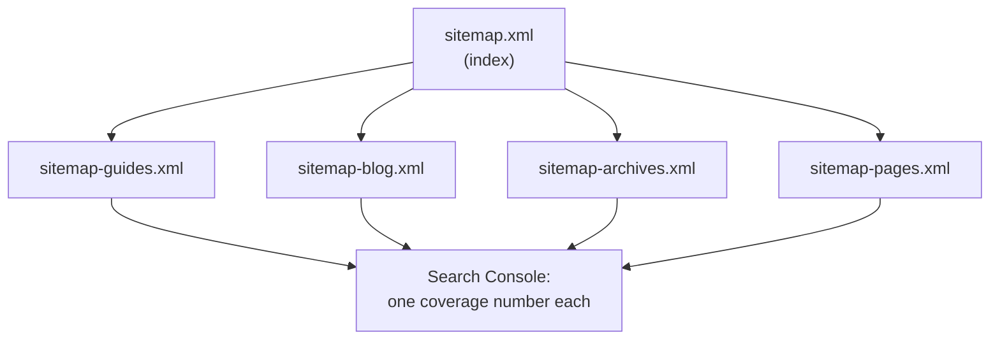

An agency's SEO problem is not usually a hard problem. It is the same easy
problem, forty times, and nobody has forty afternoons.

A client emails: *organic traffic to our guides is down, are they even
indexed?* You open Search Console, look at Pages, and find a number for the
whole property:

```text
Indexed          1,284
Not indexed        372
```

Three hundred and seventy-two of what? Guides, blog posts, tag archives,
paginated listings, an old campaign microsite nobody remembers? The report will
tell you eventually, one filter at a time. Multiply by the number of clients on
the retainer and the honest answer becomes "I'll look into it", which means next
week.

## Search Console reports per sitemap, and that is the lever

This is the part that is easy to miss, because it looks like a filing detail:
Search Console keeps indexing coverage **per submitted sitemap**. Submit one
file and you get one number for the property. Submit four and you get four
numbers, each answering a question you actually asked.

Since 1.8.58 SSG can produce those four files from configuration:

```yaml
sitemaps:
  - path: /sitemap-guides.xml
    source: guides

  - path: /sitemap-blog.xml
    source: blog

  - path: /sitemap-archives.xml
    include: [categories, tags, authors]

  - path: /sitemap-pages.xml
    include: [pages, home, listing]
```

`sitemap.xml` becomes the index naming them, and `robots.txt` still points at
it, so nothing about submission changes. The client's question — *are the guides
indexed* — is now a row in a table rather than an investigation.



The archives file is the one that pays for itself fastest. Category and tag
archives are thin pages by nature, and they are where "discovered, currently not
indexed" quietly accumulates. Keeping them in their own file means you can see
that happening on one client without it dragging down, or hiding inside, the
number for their money pages.

## The same block in every project

The reason this matters more to an agency than to a site owner is not the
reporting. It is that the reporting becomes **comparable**.

If every site you build ships the same four sitemaps under the same four names,
then "guides coverage" means the same thing on every property. A junior can scan
twelve clients in ten minutes and flag the two that look wrong, because they are
reading the same table twelve times rather than twelve different tables.

That is a house style, and it belongs in whatever you already copy into a new
project — the config template, the starter repo, the generator you run to
scaffold a client. Four lines of YAML per section, once.

A site that does not have a guides section simply produces no
`sitemap-guides.xml`: a spec that selects nothing is reported and skipped rather
than writing an empty file, so the same block is safe to ship everywhere.

```text
   ⚠️  sitemaps: sitemap-guides.xml matched no URLs and was not written
```

## Selection is a partition, which is the part to get right

One design decision is worth knowing before you write that block, because it
changes how you order it.

A URL goes to the **first** sitemap whose selection matches it. It is a routing
table, not a set of overlapping views. Anything matching no spec lands in
`sitemap-main.xml`, which is always written and always in the index.

Two consequences, both useful:

- No URL is ever listed twice, so the coverage numbers add up to the property.
- Nothing is lost by an incomplete block. Forget a section and it appears in
  `sitemap-main.xml` rather than vanishing — which is the failure you would
  never notice.

The practical shape is specific-to-general, with the catch-all last if you want
one by name:

```yaml
sitemaps:
  - path: /sitemap-blog.xml
    source: blog                 # narrow, first

  - path: /sitemap-content.xml
    include: [pages, posts]      # everything else that is a document
```

## Migrations hit the ceiling, and the ceiling is real

The other agency-shaped case is the WordPress migration. A ten-year-old
publication with a category archive per author, tag archives, and paginated
everything crosses fifty thousand URLs more easily than it sounds.

sitemaps.org caps a single sitemap at **50,000 URLs and 50 MB uncompressed**.
Above that the file is invalid, and the way you find out is that a crawler
declines to read it — not that anything in your build complained.

That is handled now without configuration: over the ceiling, the set splits into
numbered files and the index names them. If you want to see the shape before it
matters, lower the ceiling on a small staging site:

```yaml
sitemap_max_urls: 500
```

and the build tells you what it did:

```text
   🗺️  sitemap-main.xml exceeds 500 URLs and was split into 3 files
```

`sitemap_max_urls` only lowers the limit. There is no configuration that raises
it, because a larger file is invalid whatever the config says.

## Put the checking in CI, not in a person

The deeper agency problem is that per-site vigilance does not scale, and the
answer is not a better checklist.

Recent releases moved several checks into the build itself, which means they run
on every site you have, on every commit, without anyone remembering. The build
now reports an empty canonical unconditionally:

```text
   ⚠️  10 page(s) name their own URL with an empty value
```

and refuses to write a `_routes.json` that Cloudflare would reject, and lists in
the sitemap only documents it actually wrote.

For an agency the interesting flag is `--strict`, which escalates the
configurable checks from warnings to build failures:

```yaml
check_links: warn
check_meta: warn
check_images: warn
```

```bash
ssg --config .ssg.yaml --strict
```

Run warnings locally, strict in CI, and a broken canonical or a missing meta
description fails the pull request on the client site where it was introduced —
by the person who introduced it, on the day they did.

That is the actual change in cost. Not that these problems became detectable;
crawlers detected them fine. It is that detection moved from a report somebody
has to read, weeks later, on one property at a time, to a line of build output
on all of them at once.

## Where to start

If you maintain more than a handful of sites and want one afternoon to pay for
itself:

```text
1. add a four-section `sitemaps:` block to your project template
2. resubmit sitemap.xml on the next client you touch (the index, same URL)
3. turn on check_links / check_meta as warnings everywhere
4. add --strict to CI on the next new build, not retroactively
```

Step four is deliberately last. Turning strict on across an existing portfolio
finds every accumulated problem at once, on a day you were planning to do
something else.
