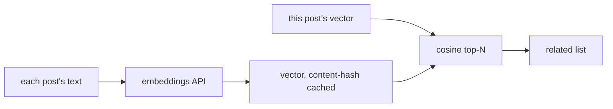

A "related articles" block is the cheapest way to keep a reader on your site: they
finished one thing, here are five more they'll probably like. The trick is that
"probably like" has three very different price tags, and most sites overpay or
underdeliver because they pick the wrong one. So here's the ladder — start at the
bottom and climb only when the matches aren't good enough.

## Level 1: keyword overlap — one line, no network

If your posts already carry `tags` and `keywords`, you're done:

```gotemplate
<aside class="related">
  {{ range related . 5 }}<a href="{{ .Link }}">{{ .Title }}</a>{{ end }}
</aside>
```

`related . 5` ranks the posts SSG already loaded by how many tags and keywords
they share with this one — most overlap first, then most recent, then by slug so
the order is *stable*. No configuration, no network, byte-for-byte reproducible.

It's literal — it matches words, not meaning — but for most blogs that's exactly
right: your tags already encode "these are the same topic," and a deterministic
build is worth a lot. This is the default you should reach for first.

## Level 2: the whole database — when the site is a slice

Sometimes the related post you want to link *isn't built into this site*. One mddb
database backing several sites; a 40,000-article archive where you only publish a
curated subset. Keyword overlap can only rank what it loaded, so it can't see the
rest.

`relatedFromMddb` asks the database directly:

```gotemplate
{{ range relatedFromMddb . 5 }}<a href="{{ .Link }}">{{ .Title }}</a>{{ end }}
```

It runs a live `Search` against your mddb server, filtered by this page's
tags/keywords, and can surface articles the current build never touched. The
trade-off is honest: it's a network call at build time, and the ranking is whatever
the server does. Use it when reach matters more than reproducibility.

## Level 3: semantic — when words aren't enough

Keyword overlap misses the two posts that are obviously about the same thing but
share no vocabulary — "cutting your cloud bill" and "why we left Kubernetes" never
match on tags, but a reader who liked one wants the other. That's what embeddings
are for: turn each post into a vector that captures *meaning*, then rank by how
close two vectors point.



The pipeline is small, and it borrows the two tricks the rest of SSG already uses:

1. **Embed once, cache by content hash** — the same content-addressed cache idea as
   the `[ai …]` shortcode, so a post is only re-embedded when it changes and the
   build stays reproducible. Commit the vector store and CI needs no key.
2. **Rank by cosine similarity** — for a few thousand posts a linear scan at build
   time is nothing; past that, reach for a vector index (your mddb server's vector
   search, or a prebuilt index loaded via `data_dir`).

There's a worked sketch of this in the repository's `related-posts` example. It
costs one embedding call per changed post — once, thanks to the cache — and buys
you the matches keyword overlap can't find.

## How to choose

| You want… | Use | Cost |
|---|---|---|
| Related among your own posts, reproducible | `related` | free, offline |
| Related from a bigger corpus | `relatedFromMddb` | a live query |
| "About the same thing," different words | embeddings + cosine | one embed per changed post |

Don't start at the top. Ship `related . 5` today — it's a line of template and it's
already better than most sites' "related" blocks. Climb the ladder only when you can
point at the specific matches the cheaper level is missing.
