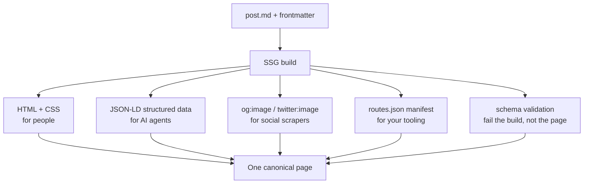
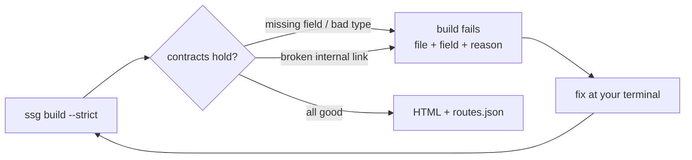

Most of what a static site generator does is for people: render the Markdown,
style the page, ship the HTML. But a page has other readers you never think
about — the scraper that builds a link preview, the answer engine deciding what
your article is about, the script three teams over that hard-codes one of your
URLs. They read the *same* HTML, and historically SSG left them guessing.

1.8.14 is the release that stops making them guess. None of it adds a runtime or
a build step you have to babysit; it's the same one-binary build, emitting a bit
more of what the machines were always looking for.

## One Markdown file, many readers

Here's the shape of it. A single Markdown file with good frontmatter now fans
out into everything the humans *and* the machines need — with no extra source of
truth to keep in sync.



The rest of this post is the four features that fill in those branches.

## Social previews that stop 404-ing

If you turn on WebP conversion, SSG replaces each `photo.jpg` with a smaller
`photo.webp` and rewrites the `` tags to match. That's been true for a
while. What was quietly broken: the `og:image` meta tag — the one a link preview
actually reads — kept pointing at the `photo.jpg` that no longer existed. Every
share of that page fetched a 404 and rendered a blank card.

Now the WebP reference pass rewrites the social tags too. `og:image`,
`twitter:image` and the JSON-LD `image` all follow the conversion to `.webp`,
exactly like an in-content image. And SSG now emits `twitter:image` and a
JSON-LD `image` from your `featured_image` in the first place — previously only
`og:image` was written, so large-image Twitter cards came up empty. One
frontmatter field, `featured_image`, now drives the whole preview, and it points
at a file that exists.

## Structured data, for the agents

In 2026 a real fraction of your readers are not people. They're LLM-backed
agents and answer engines, and they strongly prefer a page that *tells* them what
it is over one they have to infer from prose. Static sites are already good for
this — clean markup, no JavaScript to execute — and 1.8.14 leans in.

With `seo` on, every page now carries a `<script type="application/ld+json">`
block derived from the frontmatter you already wrote. No new configuration; the
content types map to the right schema.org types:

- a blog post becomes a `BlogPosting`, with `headline`, `datePublished` /
  `dateModified`, an `author`, `keywords` from its tags, and `mainEntityOfPage`;
- the home page becomes a `WebSite`;
- every other page becomes a `WebPage` — previously they were all mislabelled as
  `WebSite`, which was simply wrong.

Every non-home page also gets a `BreadcrumbList` built from its URL, so an agent
can place it in your site's hierarchy without crawling. And when you need more
than the defaults, two layers of override deep-merge over the generated data:
site-wide defaults in your config (a publisher `Organization` that belongs on
every page) and a per-page `schema:` block in frontmatter that wins over
everything. Untrusted titles can't break out of the script tag — the JSON is
HTML-escaped — so this is safe to turn on for a site with user-supplied content.

## Contracts: fail the build, not the page

The oldest failure mode in a content site: a post ships with a missing `author`
or a `date` typo'd into nonsense, nothing complains, and the broken page sits
live until someone notices. 1.8.14 borrows the idea that a contract should be
checked, not hoped for.

You declare, per content type, what a page must look like:

```yaml
content_schemas:
  post:
    required: [title, date, author]
    fields:
      title:  { type: string }
      date:   { type: date }
      status: { type: enum, values: [publish, draft] }
      featured_image: { type: url }
```

At build time every post and page is validated against its type's schema. A
violation is reported with the file, the field and the reason — not a vague
warning you scroll past. By default those are warnings, so you can adopt schemas
on an existing site one type at a time.

Flip on `strict` (or `--strict`) and the whole posture changes: schema
violations become hard build failures, and so does internal link checking — even
if you hadn't turned it on. A renamed slug that orphans a link, or a post missing
a required field, now *fails the build* instead of shipping. The failure moves
from your readers back to your terminal, which is the only place a broken build
belongs.

There's a companion output for the same instinct. Turn on `route_manifest` and
SSG writes `routes.json`: a sorted, de-duplicated list of every route it
generated — posts, pages, and every category / tag / series / author / custom
archive — each with its type, title, source file and language. Check it into
git and a moved URL shows up as a diff in review, before it 404s in production.
It's also the contract an external tool, or a generated typed client, can read to
know your routes without scraping them.



## A smaller thing: aliases that 301 instead of copy

If you migrated a site, you probably have old slugs redirecting to new ones.
SSG has always written those as real `301`s in `_redirects`, but it *also*
dropped a little meta-refresh copy at the old path — a 200-serving duplicate that
crawlers spend budget on and that reads inconsistently next to a hand-written
redirect.

Now you can turn that copy off per page. Set `alias_stubs: false` in a post's
frontmatter (or site-wide in config) and its aliases emit the `301` only — no
duplicate — so a legacy `/hotel-term-condition/` consolidates cleanly onto
`/terms-conditions/` while the rest of the site keeps its stubs. The `301` is
always written either way.

## Under the hood: one taxonomy engine

One change ships with no visible output at all, which is the point. The built-in
category, tag, series and author archives used to run on four separate code
paths, bolted on next to the general taxonomy engine. In 1.8.14 they're all
driven by that one engine — a single place that renders every archive.

The output is byte-for-byte identical: there's a golden-snapshot harness that
builds four fixture sites and fails if a single generated byte moves, and it
stayed green through the whole refactor. You get nothing new from this today.
What you get is that the *next* taxonomy feature only has to be written once.

## The build got parallel

One more thing you *will* feel: WebP image conversion no longer happens one image
at a time. It runs on a worker pool now — one worker per CPU by default, or
however many you cap it to:

```bash
ssg my-site simple example.com --webp --workers=2   # or leave it off for all cores
```

Leave `--workers` unset and it uses the whole machine; write a number for exactly
that many; write `0` to turn it off and build sequentially. The output is
byte-identical whatever you pick — checked under Go's race detector and the same
golden harness. On an image-heavy site this is the difference you'll notice most.
The HTML render stays sequential for now (it threads per-language state through
the template context, so parallelising it safely is its own change). The longer
story — plus three build-speed features that were quietly working all along and
never got written down — is in [The Build Got Parallel](/blog/faster-builds/).

## Getting it

Everything here is opt-in, and a plain build still just renders HTML to
`output/`. The structured data rides on the existing `seo:` switch; contracts,
strict mode and the route manifest are new keys documented in the
[configuration guide](/configuration/):

```yaml
seo: true
content_schemas:
  post:
    required: [title, date, author]
strict: true
route_manifest: true
```

The theme is the same, the binary is the same, the deploy is the same. There's
just a little more of your site that machines can read without you writing it
twice.
