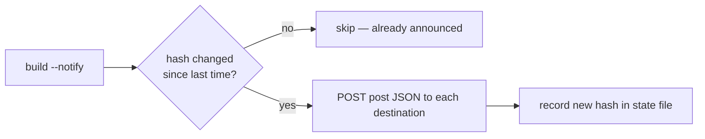

The last two releases were about speed and structure. 1.8.16 is about the *edges*
of publishing — the small jobs around a post that you either do by hand every time
or wire up a SaaS for: summarising it, announcing it, linking it to its
neighbours, and hearing about the first comment. Four features, all opt-in, all
still a plain static build with no runtime.

## Ask an AI from inside a post

You can now put `[ai question="…"]` in your Markdown and SSG bakes the answer into
the page **at build time** — once, content-addressed cached, so builds stay
deterministic and CI can rebuild with no key and no network. An `ifs` guard gates
it on the page's own fields (`type == post AND lang == en`), and a `fallback`
covers a draft, a miss or a timeout. It's for the repetitive margins — a summary,
a meta description, a takeaway box — not the body. The full argument for why build
time beats the browser is in [AI in Your Content](/blog/ai-in-content/).

## Announce a post — exactly once

New in 1.8.16: post-publish **notifications**. You declare destinations — webhook
URLs you point at a platform API, an automation service, or your own endpoint —
and each newly published post is `POST`ed to them as JSON. The two things that
usually go wrong here don't:

- **It never double-posts.** A committed state file records a content hash per
  post, so a post is announced **once** — and again *only* when its content
  actually changes. Rebuild the whole site a hundred times; a given post fires
  once.
- **It never fires by accident.** Nothing is sent unless you pass `--notify`, so
  local dev builds stay silent. Put `--notify` in your deploy step and only the
  real publish announces.



```yaml
notify_state: .ssg-notifications.json   # commit it — this IS the sent-history
notifications:
  - name: fanout
    url: https://hooks.example.com/…    # → X / LinkedIn / a Slack channel / …
    headers: { X-Token: $HOOK_TOKEN }
```

Secrets come from `$ENV`; the delivery transport refuses private/loopback ranges
at dial time, so a webhook URL can't be turned into an SSRF pivot; and a
destination that's down is simply retried on the next `--notify` run. One generic
mechanism, every target — no fragile per-platform OAuth to babysit.

## Related posts, two ways (three, if you count semantics)

A `related` template helper returns the posts most related to the current one by
shared **tags and keywords**, ranked and deterministic, reading the content you
already loaded — no network. A companion `relatedFromMddb` does the same by
querying your **mddb** corpus, so it can surface articles that aren't even built
into this site. And if keyword overlap isn't smart enough, the `related-posts`
example in the repository sketches the embeddings + vector path for true semantic
matches, cached the same way the AI answers are.

```gotemplate
{{ range related . 5 }}<a href="{{ .Link }}">{{ .Title }}</a>{{ end }}
```

## An email when a comment lands

The comments worker can now email you the moment a **non-spam** comment arrives —
set a mail endpoint, a from and a to, and it sends a moderation notice in the
background (so the visitor's submit never waits on it). Spam is filtered silently
and never mailed. It uses an HTTP email API (the shape providers like Resend
accept, or your own relay), because a Cloudflare Worker can't speak SMTP — and
shouldn't have to.

## A development server your assistant can work in

Finally, `ssg mcp` starts a Model Context Protocol server so an AI assistant can
work on the site *during development* — as two coworkers with hard boundaries. The
**designer** edits templates and theme assets and can't touch content; the
**content manager** creates, fixes and removes Markdown and can't touch templates.
Each tool spells out what the model can and cannot do, every change rebuilds the
site (errors go straight back to the assistant to fix), and with a git account and
`$ENV` token configured the work lands on a branch and becomes a pull request
**only after you approve**. There's a [full walkthrough with the flow
diagram](/blog/mcp-development-server/).

## The through-line

None of this is a new runtime. The AI answer is HTML in the file. The notification
is a build-time POST. The related list is computed while the page renders. The
comment email runs at the edge, next to the comment. The MCP server edits the same
files you would, behind the same git gate you'd use. Static-first was never about
doing less — it was about doing it once, at build or at the edge, and shipping
plain output. 1.8.16 just moves five more chores to that side of the line.
