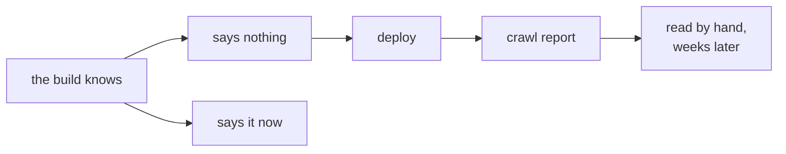

A crawl report arrived for a site that had been building cleanly for a month.

```text
Indexable page not in sitemap        1 page,  21 internal inlinks
Noindex page in sitemap             23 pages
4XX page in sitemap                  1 page
Page has no canonical URL           10 pages
```

Every one of those had shipped from a build that printed a green checkmark, a
link check that found nothing broken, and a test suite that passed.

Four releases later, most of them are gone. What is worth writing down is not
the individual fixes — they are in the changelog — but the shape they share,
because it is a shape a static site generator is unusually well placed to catch
and had been letting through.

## The failure that cannot be seen from inside the build

Consider a theme that writes its canonical URL like this:

```gotemplate
<link rel="canonical" href="{{ .CanonicalURL }}"/>
```

On a page, that is correct. On a category archive, in versions before 1.8.56,
the archive context carried no such key.

Go's `html/template` resolves a missing map key to nothing. It does not fail.
It does not warn. It renders:

```html
<link rel="canonical" href=""/>
```

The build succeeds. The file exists, so the link checker is happy — there is no
link to follow. The page renders correctly in a browser. Ten archives on one
site shipped that to production, along with an empty `og:url` and an empty
`twitter:url`, and it surfaced when somebody read a crawl report by hand.

This is the whole class in one example. The generator had every fact needed to
know something was wrong, at the moment it was writing the file, and said
nothing.

## Three places the same thing happened

**The sitemap disagreeing with the site.** A sitemap is the one file where a
site states its own structure, and it kept getting that statement wrong in both
directions.

It advertised archives that were never written, and omitted documents that were.
The post listing at `/blog/` — the hub every post links back to, 21 internal
inlinks, the most linked page after the home page — belonged to neither the
pages collection nor the posts collection, so no branch of the sitemap writer
could reach it. A hand-authored application published verbatim had the same
problem for the same reason: the generator copied it rather than rendering it,
so it never became a page.

Elsewhere the sitemap was too eager. Three separate places treated category
**id 1** as "Uncategorized" and skipped it, a convention that lives in
WordPress's database and not in exported data. On a migration whose export
numbered categories from one, id 1 was a real category holding two thirds of the
site's posts. Its archive was rendered, linked from every post in it, and absent
from the sitemap with no feed.

**A setting that parsed and did nothing.** `taxonomies: { tag: { sitemap: false } }`
validated cleanly and changed nothing, because the built-in taxonomies are
listed by a different code path than the one that read the flag. A site whose
theme marked its tag archives `noindex` used that setting to stop advertising
them, watched a crawler report 23 pages as *noindex page in sitemap* anyway, and
concluded the archives should be indexable after all.

That is the expensive kind. The site was changed to fit a setting that could not
take effect.

**A failure that is not in the build at all.** Cloudflare Pages rejects a
`_routes.json` whose rules overlap:

```text
✘ [ERROR] Invalid _routes.json file found at: _routes.json
  Overlapping rules found.
```

The generator wrote that file itself, by combining every worker's routes. A
middleware worker beside two route-owning workers produces `/api/*` alongside
`/api/contact` — and a worker that names no routes at all defaults to `/api/*`,
which is exactly the value that overlaps. The build was green. The site could
not be published at all, and you found out after the upload.



## What actually changed

Three rules came out of it, and they are more useful than the individual
patches.

**If the generator writes the file, it must not write an invalid one.** The
`_routes.json` fix is not a warning. A rule already covered by a splat in the
same list is folded into it before the file is written:

```text
/api/contact, /api/consent/* and /api/*   →   /api/*
```

That is what the site meant, it is what Cloudflare accepts, and it spends one of
the hundred allowed rules instead of three.

**The sitemap may only name documents the build actually produced.** Not the
metadata's opinion of what exists — the record of what was written. A term with
no posts has no archive and gets no entry. A category served away from
`/category/` by its own link is named where it really lives. The rule now runs
in one direction and one place, which is also what made the missing documents
easy to add once somebody noticed they were missing.

**When a value is wrong in a way that is wrong for every site, say so.** Not
"configurable, off by default" — those are the checks nobody turns on. Every
build now reports an empty canonical:

```text
   ⚠️  10 page(s) name their own URL with an empty value
      category/air-conditioning/index.html → <link rel="canonical">, og:url
```

There is no site for which `href=""` is correct, so it needs no mode to enable.
It is a warning rather than a build failure, because the site is publishable and
a build that refused to finish over a theme bug would be worked around rather
than fixed.

The distinction matters. A canonical that *disagrees* with the permalink is a
different thing — far more often a theme quirk than a deliberate exclusion — and
that one stays behind an opt-in, because it needs judgement. An empty one needs
none.

## The one that was not a bug

The same week produced a question rather than a report: what happens when the
sitemap gets too big?

The answer had been "nothing good". sitemaps.org caps a single file at 50,000
URLs and 50 MB uncompressed, and above that a `<sitemapindex>` is required.
Before 1.8.58 the generator wrote the oversized file anyway — the same failure
shape again, one step further out.

Size is now handled without configuration: a set over the ceiling is split into
numbered files, and `sitemap.xml` becomes the index naming them. `robots.txt`
does not move, because an index served where a urlset used to be is exactly what
the protocol expects.

Structure is declared, in the shape the `feeds:` block already uses:

```yaml
sitemaps:
  - path: /sitemap-blog.xml
    source: blog

  - path: /sitemap-archives.xml
    include: [categories, tags, authors]
```

The reason to want this is not size. Search Console reports indexing coverage
**per submitted sitemap**, so "how much of the blog is indexed" is a question
only a separate file can answer.

Selection is a partition rather than a set of views: a URL lands in the first
spec that matches it, so nothing is listed twice, and whatever matches no spec
is written to a default file rather than dropped. A site that declares nothing
gets exactly the single file it always got, byte for byte.

## Why a generator is the right place for this

A crawler finds these problems by fetching a published site and comparing what
it finds against what the site claims. That is real work, done days later, by
something you may not control.

The generator has all the same facts, earlier and for free. It knows which
documents it wrote, because it wrote them. It knows what the sitemap claims,
because it is the thing making the claim. It holds the finished HTML in memory
immediately before writing it to disk, which is the cheapest possible moment to
notice that a canonical is empty.

None of the checks added this week cost a measurable amount of build time. The
canonical scan looks only at `<head>`, and only at documents that have one of
those tags at all. The route normalisation runs over a list that is almost never
longer than a dozen entries.

What they cost was the assumption that a green build means a correct site. That
assumption was never true. It is now slightly less untrue, and the difference
shows up as a line of output rather than a crawl report next month.
