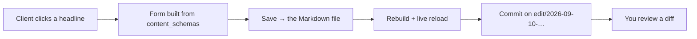

An agency's relationship with a static site generator is lopsided. Building the
site is the part you are good at and the part that takes a week. Everything
after it — the client emailing about a phone number in the footer, the third
site this month that needs the same testimonial block, the analytics that was
supposedly installed in March — is the part that takes a year.

1.8.60 is a release about that second part. There is very little in it about
generating HTML faster.

## The email

Here is the one every agency knows. A client writes: *"Can you change the
headline on the services page? It should say Warsaw, not Warszawa."*

That is fifteen seconds of work and forty minutes of process. Someone opens the
repository, finds the file, edits the frontmatter, commits, waits for the build,
sends a link, and the client replies asking for one more word.

`ssg --http --watch --edit` turns the preview server into an editor. The client
opens the preview, clicks the headline, changes it, and saves. The change lands
in the Markdown file it came from, the site rebuilds, the page reloads, and the
edit is committed to a git branch of its own — never to the branch you have
checked out.



You still review a diff. That is the entire point: the client gets to make the
change, and you get to see exactly what changed, in the tool you already use to
see what changed.

### What they can and cannot touch

The form is built from your `content_schemas`. A field declared as an `enum`
becomes a menu of exactly its allowed values. A `date` becomes a date picker. A
required field is refused when empty, with the rule that refused it:

```text
status must be one of: publish, draft
2026-13-45 is not a date (write it as 2026-09-10)
```

A page is editable where **your theme says so**, with one attribute:

```html
<h1 data-ssg-edit="frontmatter:title">{{ .Post.Title }}</h1>
```

Everything else is inert. That is a deliberate limit rather than an unfinished
one. Most of the text on a rendered page did not come from the body of a file —
a heading built from `title:`, a date run through a formatter, a label the
template composed — and an editor that guesses where text came from is an editor
that eventually changes the wrong paragraph. Refusing is cheap; a wrong silent
save is not.

The attributes never reach a published page. A build without `--edit` strips
them, byte for byte, so your themes can carry them permanently.

This release does frontmatter: titles, dates, descriptions, tags. Editing body
text is the next phase, and it is deliberately not guessed at.

## The same block, on the ninth site

Every agency ends up with a house component library: a testimonial block, a
pricing table, a video embed with the right privacy host. Until now the only way
to ship one in SSG was a shortcode defined in the site config — a fixed name
rendering fixed data. Two galleries meant two config entries.

A component is now a directory with a contract:

```text
components/testimonial/
  component.yaml    props: their types, which are required, defaults
  template.html     the markup
  assets/           css that travels with it
```

```yaml
# component.yaml
props:
  quote:  { type: string, required: true }
  author: { type: string, required: true }
  role:   { type: string }
  tone:   { type: string, enum: [light, dark], default: light }
```

Called from content, with its arguments:

```text

```

The schema is what makes this worth having across a portfolio. A component
becomes usable by someone who has never read its template; a call that forgets
`quote` fails the build with the file, the prop and the reason rather than
rendering an empty box; and the component's CSS is copied and linked **only on
the pages that use it**, so site number nine does not ship the stylesheet for a
block it does not have.

There is one more consequence worth naming. Every build publishes
`components.json` — the props, their types, what is required, and a copyable
example. That is the difference between an AI assistant that can write content
for a client site and one that can only write prose: without the contract it
either avoids your components or invents attributes for them, and nobody notices
until a reader does.

Two things are *not* calls, and both were learned the hard way while building
this: a call naming a component the site does not have is left in the page as
written, and a call inside a code fence is not a call at all. Documentation that
quotes the syntax stays quoted.

## The images you inherited

If you migrate WordPress sites, you have hundreds of content images that look
like this:

```markdown

```

Bare. No `srcset`, no width, no height, no `loading="lazy"`. SSG has had a
responsive image pipeline for a while, and it was reachable only from templates
— so it never touched a single image inside migrated content. That is the
Largest Contentful Paint problem on exactly the sites that have it.

Render hooks close that. A hook is a template that renders one kind of Markdown
node, at the syntax tree rather than by rewriting HTML afterwards:

```yaml
render_hooks:
  image: hooks/image.html
  link: hooks/link.html
```

```gotemplate
{{/* hooks/image.html — every content image on every site, at once */}}
<figure class="content-image">
  
  {{- with .Title }}<figcaption>{{ . }}</figcaption>{{ end }}
</figure>
```

And the one nobody remembers to do by hand:

```gotemplate
{{/* hooks/link.html */}}
{{- if .IsExternal -}}
  <a href="{{ .Href }}" rel="noopener noreferrer nofollow" target="_blank">{{ .Text }}</a>
{{- else -}}
  <a href="{{ .Href }}">{{ .Text }}</a>
{{- end -}}
```

`rel="noopener"` is a security property, not a nicety, and before this release
there was no way to apply it to links written in content.

Six hooks ship: image, link, heading, code, table and blockquote. Without them,
nothing is registered and your output is byte for byte what it was.

## The analytics that was never installed

This one is uncomfortable. Google Tag Manager is two tags: a script in `<head>`
and an iframe immediately after `<body>`. SSG emitted the first and not the
second. And the snippet rode inside the SEO pass, which meant two things at
once: a site with `seo: false` got no tracking at all despite having asked for
it, and a site with both flags on had an untracked **home page** and untracked
archives — the pages an analytics report is mostly about.

Both are fixed, and a site can finally declare its own id:

```yaml
analytics_ids:
  gtm: GTM-XXXXXXX
```

Declaring one is the consent that `analytics: true` exists to ask for, so it
renders on its own. Before this, the only way an id could reach a build was for
a migration's crawl to have found one — which meant a hand-built client site
could not run a tag manager without you editing a theme.

If you run client sites with GTM, it is worth checking a page source today.

## Changing forty configs without destroying them

```
ssg config set highlight_style github-dark
ssg config set taxonomies.audience.multiple true
ssg config set headers."/css/*".Cache-Control "public, max-age=86400"
ssg config unset mermaid_background
```

The part that matters for a portfolio is what it does *not* do. Configs carry
their reasoning in comments — why this cache header is a day and not a year, why
that language is disabled. The editor splices the change into the text at the
position it found, so setting one value changes one line and leaves every
comment, blank line and key order alone. An edit that would break the config is
validated in a scratch file first, so a rejected change never touches the real
one.

It is scriptable across a directory of repositories, which is how it will
actually get used.

## The rest, briefly

- **`--profile`** answers where a build's time goes: phases in order, the
  counters it kept, the ten slowest pages. Useful the first time a client site
  crosses forty seconds and you need to know whether it is images, the search
  index, or one enormous page.
- **`site_graph: true`** publishes one JSON model of the site — every page,
  section, taxonomy, link and redirect — and `ssg mcp` answers questions from
  it. "Which pages link to /pricing/?" is one call rather than a grep.
- **Records as pages**: a client's product CSV or a headless CMS endpoint
  becomes one page per record, with real URLs and taxonomy archives, via a
  `content_map` that says which field is the title and which is the body.
- **Versions and relations** in frontmatter, for documentation sites: old
  revisions canonicalise to the current one instead of competing with it in
  search results.

## What I would turn on first

In order of what pays off soonest across a portfolio:

```text
1. analytics_ids — check one client's page source; you may be missing half a GTM install
2. render_hooks.image — one template, every content image on every site
3. render_hooks.link — rel="noopener" on external links, everywhere
4. components/ — move your house blocks out of per-site config
5. --edit — offer it to the one client who emails you most
```

The first three are configuration. The fourth is a directory. The fifth is the
one that changes how a client thinks about their own site, so it is worth
starting with a client you like.
