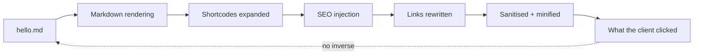
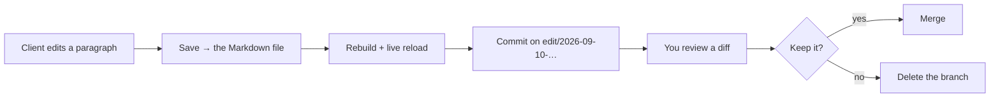

Every agency that has ever handed a client a CMS knows the tradeoff. Give them
an editor and you stop being the bottleneck for typos. Give them an editor and
you inherit whatever they do with it.

1.8.60 finishes the browser editor that started as frontmatter only. The client
can now click a paragraph, not just a headline. This post is about the part
that was hard, because it is also the part that decides whether you would let a
client near it.

## Why the body was a separate phase

Editing a headline is easy. The theme says which field the element came from:

```html
<h1 data-ssg-edit="frontmatter:title">{{ .Post.Title }}</h1>
```

A click on that is unambiguous. It is `title:` in a specific file, and the save
knows exactly where to go.

A paragraph has no such label, and the obvious approach is a trap. Take the
text of the element, find it in the Markdown file, replace it. That works on
the first page you try and fails on the tenth, because the HTML on screen is
not the Markdown in the file. Between them sit Markdown rendering, shortcode
expansion, SEO injection, link rewriting, sanitisation and minification — and
none of that has an inverse.



An editor built on "find this text in the file" is an editor that eventually
changes the wrong paragraph, silently, on a client's live site. That is why the
first release shipped frontmatter and said body text was deliberately not
guessed at.

## The rule it uses instead

A click does not search the file for its text. It looks for the **block**.

The source is split into the blocks Markdown is actually made of — paragraphs,
headings, list items, quotes, fenced code. Each block's plain text is compared
with the clicked text after normalising the things the build is known to
change: collapsed whitespace, smart quotes, en and em dashes, ellipses,
non-breaking spaces. The edit proceeds only when **exactly one** block matches.

Zero matches, or several, and it refuses, in those words:

```text
This text appears 2 times in the file, so an edit here could change
the wrong one — edit it in the file, or make the passages different.
```

```text
This text is not a block of the source — it may be generated by the
theme rather than written in the file, or changed by the build on the
way to the page.
```

Both of those are the feature working. A repeated sentence in a long page, or a
line the template composed rather than the author wrote, is exactly where a
clever editor would guess and be wrong.

The save then goes through the same anchored-edit path the MCP tools use, whose
contract is the same rule one level down: the anchor must appear exactly once
in the file, or nothing is written. Two independent checks of one property,
because the failure they prevent is a green save that changed something else.

## What the client is allowed to do

The same limit as before, and it is worth restating because it is the answer to
"what will they break".

A page is editable **where your theme says so**. One attribute per element,
nothing else on the page responds to a click. The attributes never reach a
published site: a build without `--edit` strips them byte for byte, which the
golden corpora check on every release.

The panel shows the **Markdown source**, not the rendered HTML. An author
editing a render means a lossy round trip back to Markdown, and someone seeing
`**bold**` is at least seeing what is in the file.

And the guard rails around the mode itself:

| Combination | What happens |
|---|---|
| `--edit` without `--http` | Refused: there is no preview server to edit in |
| `--edit` without `--watch` | Refused: a save would change the file and leave the browser showing the old page |
| `--edit` on a non-loopback host, no token | Refused: this is a file-writing endpoint, and it will not go on a network unattended |
| `--edit` on localhost | A session token is minted for you |

Refusing at startup rather than at save time is deliberate. A misconfigured
editor that appears to work is worse than one that will not start.

## Where the edits go

Not onto your branch. Each session's changes are committed to a branch of their
own, and you review a diff in the tool you already use to review diffs.



The local flow needs no forge token at all — `--edit` commits to a local branch
whether or not the machine can reach GitHub. Opening a pull request is the part
that needs credentials, and it is optional.

## The four AI buttons, and what they will not do

With a model configured, the panel offers four things a person actually asks
for while looking at a page: shorten this excerpt to the length search engines
display, propose a title of at most sixty characters, write alt text for this
image, translate this block.

Two rules make them safe enough to hand a client.

**An action proposes; it never saves.** The answer lands in the field being
edited, and the save is still the save the person makes themselves, through the
same endpoint and the same validation. A model that misreads an instruction
produces a suggestion someone rejects, not a change someone finds a month
later.

**The key never reaches the browser.** The dev server holds it exactly as the
build does, calls the model itself, and hands back text. The panel has no
credential and no way to talk to a provider directly. If you are running this
session on a client's machine, the client does not end up with your API key.

There are four actions and there will not be a fifth this release. Each one is
a thing somebody asks for with a page in front of them; a general "improve this
text" button is not.

## What I would actually do with this

- **Run it for a review call, not as a permanent CMS.** `ssg --http --watch
  --edit` on your machine, screen shared or the client on the same network with
  a token. Forty minutes of "can you change that" becomes forty minutes of them
  changing it while you watch, and you leave with a branch.
- **Mark two or three elements per template**, not everything. The refusals
  above only help if what is clickable is what is genuinely editable.
- **Read the branch before you merge.** The whole design assumes you will. It
  is the reason the editor is allowed to be this direct.
- **Turn the AI buttons on for excerpts and alt text first.** Those are the two
  jobs nobody enjoys and where a proposal is genuinely faster than a blank
  field.

The measure of an editor like this is not what it lets someone change. It is
what it refuses to guess at, and whether it says so out loud.
