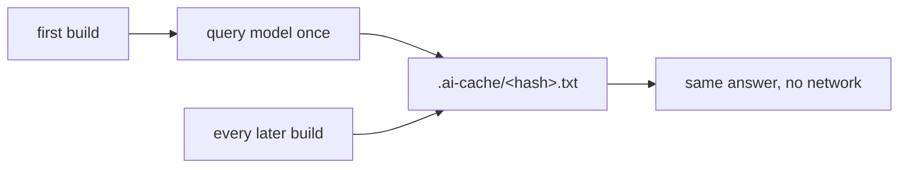

This is the hands-on companion to [AI in Your Content](/blog/ai-in-content/). That
post argues *why* build-time AI beats a browser widget; this one gets you from
zero to a working `[ai …]` in about five minutes.

## 1. Get a key and keep it out of the repo

You need an endpoint that speaks OpenAI-style chat completions (most providers do)
and an API key. Put the key in your environment, never in the config file:

```bash
export OPENAI_KEY="sk-…"        # locally
# in CI: add OPENAI_KEY as a secret and export it in the job
```

## 2. Declare a model

In your `.ssg.yaml`:

```yaml
ai:
  default_model: fast
  cache_dir: .ai-cache
  timeout: 30s
  models:
    fast:
      url: https://api.openai.com/v1/chat/completions
      key: $OPENAI_KEY               # ← reads the env var, never a literal
      model: gpt-4o-mini
      system: "Answer in one short, factual sentence. No preamble."
      rules:                         # guardrails every query with this model obeys
        - "Answer in the page's language."
        - "Never invent facts or links."
      skills:                        # what this model is set up to do
        - "Summarise long text into one sentence."
    smart:
      url: https://api.openai.com/v1/chat/completions
      key: $OPENAI_KEY
      model: gpt-4o
```

Two models is a common setup: a cheap fast one for summaries, a stronger one for
the occasional harder ask. The `system` prompt is where you set tone and length —
spend a minute here and every answer gets better. `rules` are the guardrails a
model must obey and `skills` are the jobs it's set up for; define them once and
every `[ai …]` using that model inherits them (change either and the cache
re-queries).

## 3. Write your first shortcode

In any post's Markdown:

```markdown
## In one line

[ai question="Summarise this post in one sentence for a busy reader."
   fallback="_summary pending_"]
```

Build the site. The shortcode is replaced by the model's answer; the `fallback`
shows only if the query fails or the feature is off. With one model configured you
can drop `model=` entirely — it uses the default.

## 4. Gate it with `ifs`

You rarely want *every* page hitting the API. `ifs` runs the query only when a
condition over the page's own fields is true:

```markdown
[ai question="Write a 150-character meta description for this article."
   ifs="type == post AND lang == en AND status == publish"
   fallback=""]
```

The operators are `==`, `!=`, `contains`, `>`, `<`, `>=`, `<=`, joined with `AND`
/ `OR`. The left side is any field: `lang`, `status`, `type`, `category`, `tags`,
`title`, or any custom frontmatter key and any site variable. False ⇒ the fallback,
no request.

## 5. Commit the cache (the important step)



Answers are cached by a hash of `model + question`. **Commit `.ai-cache/`** and the
win is real: CI rebuilds the exact same content with **no key and no network** —
the answers are versioned next to your words. You only re-query when you change the
question or the model. A rebuild after a typo fix is free.

```bash
git add .ai-cache && git commit -m "cache AI answers"
```

## Recipes worth stealing

- **One-line TL;DR** at the top of long posts: `[ai question="Summarise in one sentence: {{ paste the intro }}"]`.
- **Meta description**, gated to published English posts (see step 4) — consistent across hundreds of pages.
- **Plain-language gloss** of a jargon paragraph: `[ai question="Rewrite this for a non-expert: …" ifs="category == deep-dive"]`.
- **Draft alt text**: `[ai question="One-sentence alt text for an image of …" fallback=""]` — then a human checks it.

## When something looks wrong

- **You see the fallback everywhere.** The feature isn't configured (no
  `ai.models`), the key env var is unset, or the endpoint errored — check the build
  log for `⚠️ ai query`.
- **Answers won't refresh.** That's the cache doing its job. Change the question,
  or delete the relevant `.ai-cache/*.txt` (or the whole dir) to re-query.
- **A page hits the API when it shouldn't.** Tighten the `ifs`; remember an empty
  `ifs` means "always".

Keep it to the small, repeatable chores — summaries, descriptions, glosses — commit
the cache, and build-time AI stays cheap, reproducible, and invisible to your
readers except as finished text.
