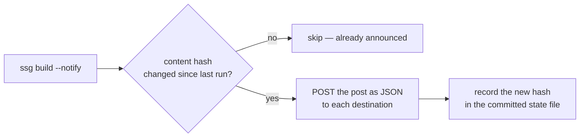

Everyone who has ever automated "tweet when I publish" has, at least once, tweeted
the same post three times — because the build ran three times. That failure mode
is the entire design problem, and 1.8.16's notifications are built around solving
it. This is how to set it up so it announces each post **once** and never on a dev
build.

## The mental model, in one picture



Two ideas do all the work: a **state file** that remembers what's been sent (by a
hash of the post's content), and a **`--notify` flag** that has to be present for
anything to go out at all. Miss either and the whole class of "oops, posted it
again" bugs disappears.

## 1. Point a destination somewhere

A destination is just a URL that receives the post as JSON. The easiest target is
an automation service (Zapier, Make, n8n, IFTTT) whose catch-hook then fans out to
X, LinkedIn, a Slack channel, an SMS gateway — whatever you like. You can also
point it straight at a platform's API, or at your own endpoint.

```yaml
notify_state: .ssg-notifications.json     # commit this file
notifications:
  - name: fanout
    url: https://hooks.zapier.com/hooks/catch/12345/abcde/
    headers: { X-Token: $HOOK_TOKEN }     # secrets from the environment
```

The payload each destination receives is `{ slug, title, url, excerpt, date, tags }`
— enough to compose a post anywhere. Header secrets come from `$ENV`, never the
file.

## 2. Send only on a real publish

Nothing is sent unless you pass `--notify`. So your local `ssg --watch` builds stay
completely silent, and only the command that actually deploys announces:

```bash
# local — never notifies
ssg my-blog ssgtheme example.com --http --watch

# deploy — announces new posts
ssg --config .ssg.yaml --notify --deploy cloudflare
```

Put `--notify` in your deploy step (the GitHub Action, the Makefile target) and
nowhere else.

## 3. Commit the state file — this *is* the memory

The first time a post is announced, its content hash is written to
`notify_state` (`.ssg-notifications.json` by default). **Commit that file.** It's
the record of what's been sent, so your CI knows not to re-announce yesterday's
posts today.

```bash
git add .ssg-notifications.json && git commit -m "notified"
```

Now the guarantees fall out for free:

- **Announced once.** Rebuild and redeploy all you like — a post whose hash is
  already in the state file is skipped.
- **Re-announced on a real edit.** Change a post's title, body or date and its
  hash changes, so it goes out again — an "updated" signal, not a duplicate.
- **Untouched posts stay quiet.** Fixing a typo in *another* post doesn't re-fire
  the rest.

## What about failures and security

A destination that's down or returns an error is simply **not recorded**, so it's
retried on the next `--notify` run — a flaky webhook can't make you miss an
announcement, and it can't make you double-send either. And the delivery client
refuses private/loopback addresses at dial time, so a destination URL can never be
turned into a probe of your internal network (set `allow_private: true` only for a
genuinely private endpoint you control).

## A complete, working example

```yaml
notify_state: .ssg-notifications.json
notifications:
  - name: social-fanout
    url: https://hooks.example.com/publish
    headers: { Authorization: $PUBLISH_TOKEN }
  - name: slack
    url: https://hooks.slack.com/services/…
```

```bash
export PUBLISH_TOKEN="…"
ssg --config .ssg.yaml --notify --deploy cloudflare
git add .ssg-notifications.json && git commit -m "chore: announce new posts"
```

Ship that, and "announce my post" stops being a thing you think about — it happens
once, on publish, to wherever you decided, and never twice.
