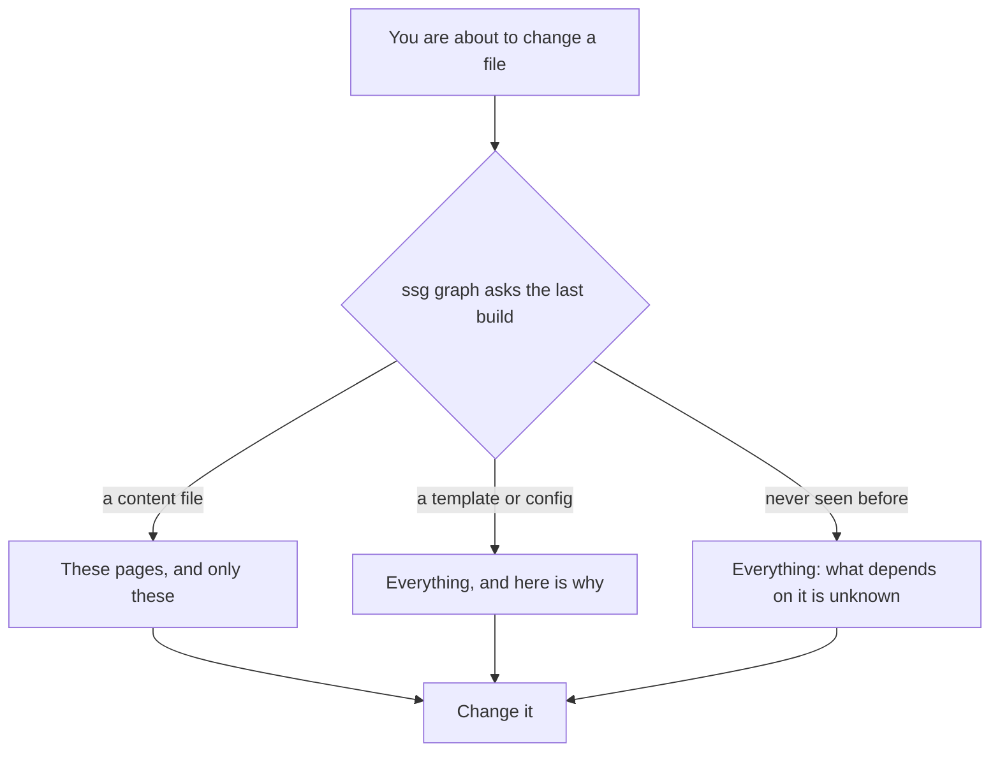
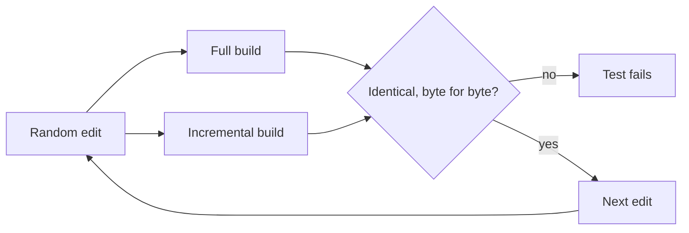

Every agency has inherited a site it did not build. The handover was a
repository URL and a sentence: *"it's pretty straightforward."* Two weeks later
a client asks for a change to the footer, and you are looking at a partial
called `block-3.html` that is included from somewhere, by something, for
reasons nobody wrote down.

You have two options. Change it and see what happens. Or spend forty minutes
reading templates to find out first.

1.8.60 adds a third: ask.

```bash
ssg graph templates/theme/partials/block-3.html
```

## The honest part first

This feature started as a performance ticket. A site with five thousand posts
takes about 1.7 seconds to build. Change one word in one post and it rebuilds
all five thousand. That is obviously wasteful, and the fix is obvious too:
record what each page was built from, then rebuild only the pages a change can
reach.

We built it. On that same five-thousand-post site, editing one post now renders
268 pages instead of 5 251.

The build takes 1.61 seconds instead of 1.70.

That is a five per cent improvement for an XL feature, and it would be easy to
write a release note that quietly mentions the 268 and not the 1.61. Here is
what the build actually spends its time on, from `ssg --profile=text`:

| Phase | Time | Share |
|---|---|---|
| Loading content | 775 ms | 48% |
| Generating site | 437 ms | 27% |
| Sitemap and robots | 307 ms | 19% |
| Everything else | ~90 ms | 6% |

Rendering pages is a quarter of the work. Loading content is half, and most of
that is converting Markdown to HTML — which every build has to do for every
page, whether or not the page will be written, because a listing template might
show any page's body. A dependency graph cannot touch that. Caching the
conversion between builds is a separate piece of work, and it is
[filed as its own issue](https://github.com/spagu/ssg/issues/270) rather than
implied.

So if you came for speed: turn it on in `--watch`, where it is on by default
now, and do not change your estimates.

The reason to care about this release is the other thing the graph knows.

## Ask before you break it

Recording what every page was built from means the build can answer questions
about itself afterwards. Not from a log, which tells you what happened, but
from the actual inputs and outputs of the last build.

```bash
$ ssg graph content/site/posts/pricing-2026.md
content/site/posts/pricing-2026.md → 1 output(s)

  output/2026/03/11/pricing-2026/index.html

The listings, feeds and sitemap are rebuilt on every build and are not counted here.
```

That is the easy case. Here is the one you inherited:

```bash
$ ssg graph templates/theme/partials/block-3.html
templates/theme/partials/block-3.html → a full rebuild

  templates/theme/partials/block-3.html is a template; every page rendered
  through it may differ
```

Which is an honest answer, and a useful one, and the second half of this post
is about why it is phrased that way.



## Why it says "everything" so often

A dependency graph that is wrong in the wrong direction is worse than no graph
at all.

Consider what a wrong answer looks like. You change a partial. The graph misses
an edge and rebuilds nine pages instead of four hundred. The build is green.
You deploy. Three hundred and ninety-one pages on the live site still have the
old footer, and nothing anywhere says so — not the build output, not the tests,
not the client, until a month later when someone notices the phone number.

Green build, wrong site. We spent the 1.8.55–1.8.59 releases fixing fifteen
separate versions of exactly that failure, so the rule for this feature was
written before the code: **when the graph is not certain, it rebuilds
everything.**

The list of things it is not certain about is deliberately long:

- **A changed template or partial.** The graph does not model which pages a
  partial reaches. It could, and it would be wrong the first time someone used
  a variable to pick a partial name.
- **A changed config.** A setting can change anything.
- **A file the last build never saw.** A new post appears in an archive, a
  feed, a tag listing and the sitemap, and none of those edges exist yet.
- **`--clean`.** The output directory is emptied, so there is nothing to keep.
- **Content from a database, an API, or a CMS import.** Those change without
  any file changing, so a file comparison proves nothing.

That last group is a property of the site rather than of one build, and
`ssg graph` with no argument says so:

```bash
$ ssg graph
Dependency graph: 5104 inputs, 5000 outputs, 5000 edges

This site's builds cannot be narrowed:
  · external sources can change without a file changing

Every change rebuilds the whole site. That is correct, not a bug —
but it is also why --incremental saves nothing here.
```

An agency running twelve client sites can now tell, in one command per site,
which of them have a build that can be narrowed at all — and for the ones that
cannot, the reason is a sentence rather than a mystery.

## The image nobody would have caught

Here is the bug this feature nearly shipped with, because it is a good
illustration of what "not certain" has to cover.

A client sends a replacement product photo. Same filename, better lighting. You
drop it next to the Markdown file and rebuild.

No Markdown changed. The graph, in its first version, saw nothing, skipped the
page, and never re-copied the image. The live site kept the old photo, and the
build was green.

Assets sitting beside a page are now inputs of that page, so replacing one
rebuilds the page and refreshes the copy. It costs a wasted HTML render for an
image change, which is the right trade: correct and slightly wasteful beats
fast and stale, every time, on a client site.

There is a test for it, and for the sibling case — an image that arrives later
beside text that already referenced it.

## Proving the two builds agree

The whole feature rests on a claim that is easy to make and hard to keep: an
incremental build produces the same site as a full one.

So that claim is a test, and it is the one that decides whether this ships. A
random sequence of edits — rewrite a post, rewrite another, add a page, edit a
page — applied twice. Once to a site rebuilt whole every time, once to a site
rebuilt incrementally. After every single step, both output trees are compared
**byte for byte**.



The test also asserts that at least one build in the sequence was actually
narrowed. Without that, a version of this feature that silently gave up and
went full every time would pass every comparison and prove nothing.

## What the agents get

If you have `ssg mcp` wired into an AI assistant, the same graph is a tool:

```jsonc
site_dependencies { "path": "templates/theme/partials/nav.html" }
// → full: true, "…is a template; every page rendered through it may differ"

site_dependencies { "url": "/pricing/" }
// → content: content/site/pages/pricing.md
//   data:    data/plans.yaml
```

An assistant that can ask what a file affects before editing it is a different
proposition from one that edits and hopes. This is deliberately **not**
published in the site's public graph file: which template rendered a page is
the shape of your project, not of your client's site, and it stays in the local
cache where only someone working on the project can see it.

## What I would turn on first

- **Nothing, if you build once and deploy.** A one-shot build stays full unless
  you ask for `--incremental`, and on a site under a few thousand pages you
  will not feel it.
- **`ssg graph <file>` before touching an inherited theme.** Free, instant, and
  the only part of this release that changes how a bad Tuesday goes.
- **`ssg graph` with no argument on every site you maintain**, once. Ten
  seconds each, and you learn which of your builds can be narrowed and which
  cannot, and why.
- **`--watch` as you already use it.** It is incremental now. The output is the
  same tree it always was, proven by the test above, and you will see one extra
  line telling you what it decided.

The graph is a cache. It lives in `.ssg-cache/graph/`, `ssg cache stats` lists
it, and deleting it costs exactly one full build. Nothing about it is load
bearing, which is the way a feature like this should be able to fail.
