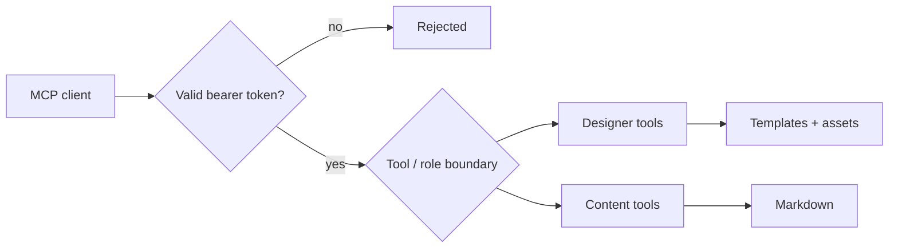

An AI development tool may begin as a demo, then gain permission to edit files,
rebuild the site, create a branch, commit changes and open a pull request. Once
it can do that, *"does the MCP connection work?"* is no longer the only question
that matters:

**who is allowed to connect to it?**

`ssg mcp` can modify a real project. An HTTP listener with that ability needs a
better security argument than "it normally runs on localhost."

## Localhost is not a security policy

An early rule treated a loopback listener as local and required a token only for
other interfaces. A common reverse-proxy deployment shows why that rule fails:

```text
Internet
   |
reverse proxy
   |
127.0.0.1:7823
   |
ssg mcp
```

The MCP process sees a loopback listener, while the rest of the world sees
whatever the reverse proxy exposes. Binding to `127.0.0.1` says little about who
can ultimately reach the endpoint.

The safer rule requires no network-topology guessing: **an HTTP MCP endpoint
gets authentication.**

## The empty environment variable problem

A second failure mode can hide in an otherwise sensible deployment command:

```bash
ssg mcp --listen=127.0.0.1:7823 --token="$SSG_MCP_TOKEN"
```

An unset shell variable expands to an empty string, so the application receives:

```text
--token=
```

If an empty token means "authentication disabled", a configuration typo has
silently turned off the control.

That is the wrong failure mode for an endpoint that can write files.

SSG now treats HTTP authentication as part of starting the listener rather than
something inferred from the address. A token can be supplied explicitly or
through the environment, and the server does not rely on "loopback means safe"
to decide whether the endpoint needs protection.

## What the token protects

A bearer token does not make an AI agent trustworthy, solve prompt injection or
prove that a requested edit is sensible.

It answers a narrower question:

> Is this client allowed to call this MCP server at all?

That boundary sits outside the role boundaries already inside `ssg mcp`.



Authentication decides who gets through the front door. Tool permissions decide
which rooms they can enter. Both controls are necessary.

## The designer still cannot become the content manager

Once a client is authenticated, the designer role still cannot write into the
content directory. The content role still cannot rewrite templates. Path
traversal is still refused. Configuration edits are still limited to the keys
the role owns.

That separation matters because credentials grant access; they do not validate
intent.

A legitimate client can still make a bad request: a model may misunderstand a
prompt, or content may contain instructions nobody intended an agent to follow.

The resulting security model has several independent layers:

```text
network access
    ↓
authentication
    ↓
tool availability
    ↓
role confinement
    ↓
filesystem validation
    ↓
build verification
    ↓
human review before PR
```

Each layer handles a different failure mode.

## Enforce boundaries in code

It is easy to put security instructions into an MCP tool description:

> Never modify files outside this directory.

That is useful context for the model, but it is not enforcement.

If the designer calls a write operation for `../../content/post.md`, the correct
response is not to hope the model notices its mistake before the tool executes.
The server should reject the path.

The same principle applies to authentication. "Only expose this behind a trusted
proxy" is documentation; rejecting requests without a credential is a control.

Documentation guides an operator. Controls also protect the system when the
operator makes a mistake.

## HTTP changes the threat model

With stdio MCP, the client starts a process and talks to its standard streams.
There is no listening socket waiting for another machine to discover it.

HTTP is useful precisely because the client and server no longer have to be the
same process on the same machine. It works through containers, remote
development environments and proxies. It also means the assumption "only my
assistant can reach this" needs to become something the server can actually
verify.

Authentication therefore belongs to the HTTP transport rather than to an
advanced configuration mode. Choosing a network transport also creates a
network security problem.

## A deliberately simple credential

SSG could implement a more elaborate authentication system. For a development
server, a bearer token has the advantage of familiar deployment: it can live in
an environment variable, pass through a reverse proxy and be attached by the
client.

It does not require SSG to become an identity provider for a development tool.

The aim is simply to avoid an unauthenticated file-editing endpoint.

## Treat the endpoint as a development interface

`ssg mcp` can find relevant code, make partial edits, rebuild the project, serve
a preview and participate in a Git workflow. Its security is therefore an
operational concern, not a theoretical one.

An MCP server with useful tools is a privileged development interface. Treating
it accordingly is what makes it suitable for a real environment.

If an endpoint can edit your website, it must verify that the caller is allowed
to do so. The apparent network path is not enough.
