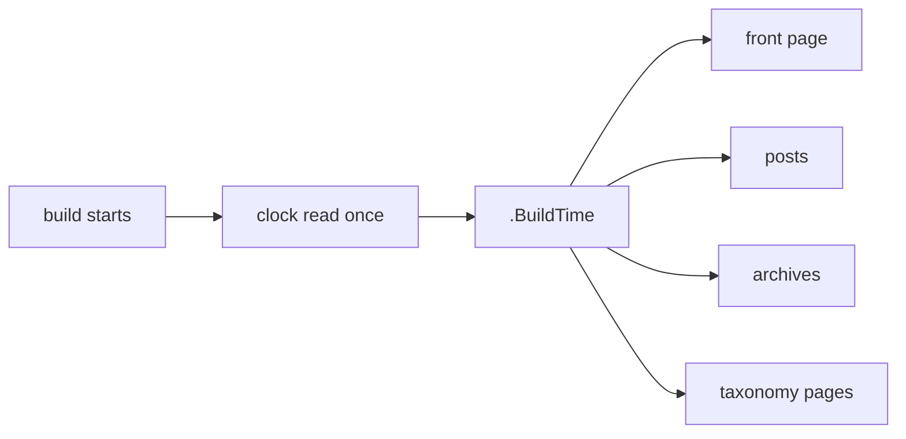

At some point on the first of January, every static site built before midnight
starts telling visitors it was made last year.

```text
© 2007-2025 example.com
```

The fix takes ten seconds. Finding out you need it takes ten months, because
nobody reads their own footer.

This is not an oversight in the generator. It is a consequence of something the
generator does deliberately, and worth understanding before reaching for the
obvious workaround.

## The guarantee that causes the problem

SSG never calls the clock while rendering. Given the same sources, the same
configuration and the same version, it produces the same bytes.

That guarantee earns its keep in ordinary places:

```text
a rebuild after an edit shows only what the edit changed
a deploy uploads the files that differ, not all of them
a CI check can compare output against a recorded baseline
two machines building the same commit agree
```

The moment any template can ask what time it is, all four weaken. A diff after
a one-word edit now includes every page carrying a timestamp. The baseline
check fails every day for a reason that is not a regression.

So the generator declines to know. And a generator that declines to know what
year it is cannot write the year into your footer.

## Why the obvious fix is the wrong shape

The instinct is a template function:

```gotemplate
© 2007-{{ now.Year }}
```

An agent editing over MCP reached for exactly this and found it did not exist.
Reasonable instinct — most template languages have it — and it is worth being
precise about why it is not the right answer here.

A function reads the clock **when it is called**. A build renders pages one
after another, and a large site takes minutes. Nothing prevents this:

```text
23:59:59.8   posts/first/index.html rendered   → © 2026
00:00:00.3   posts/last/index.html rendered    → © 2027
```

One build, two answers. Rare, and unpleasant precisely because it is rare: the
site is internally inconsistent for a year, and nobody diffs a footer.

The same reasoning rules out a build that quietly re-reads the clock per page,
per template, or per partial. The problem is not where the clock is read. It is
that it is read more than once.

## One value, read once



The clock is read when the generator is constructed, before any page renders,
and that one value reaches every template as `.BuildTime`:

```gotemplate
© 2007-{{ .BuildTime.Year }} {{ .Domain }}
```

It is a `time.Time`, so the whole of Go's date formatting is available:

```gotemplate
{{ .BuildTime.Format "2 January 2006" }}
Last built {{ .BuildTime.Format "2006-01-02 15:04 MST" }}
```

Two pages of one build cannot disagree, because there is nothing for them to
disagree about. The value is decided before rendering begins.

## Keeping reproducibility for whoever needs it

Reading the clock once is still reading the clock. A build at 09:00 and a build
at 09:05 differ, which breaks the guarantee for the people who were relying on
it: distribution packagers, CI comparing against a baseline, anyone verifying
that a published artefact matches its source.

Those people already have a convention. `SOURCE_DATE_EPOCH` is the
reproducible-builds standard: a Unix timestamp in the environment that a build
must use instead of the current time.

```bash
# Pinned: the same input produces the same bytes, forever
SOURCE_DATE_EPOCH=1700000000 ssg content simple example.com

# Unpinned: the real clock, which is what a scheduled rebuild wants
ssg content simple example.com
```

Pin it and the build is a pure function of its input again. Leave it alone and
the footer is correct. Nobody has to choose between the two globally — it is
decided per build, by whoever is running it.

The value is interpreted as UTC deliberately. A pinned epoch exists so that two
machines agree, and rendering it in local time would make the printed date
depend on where the build ran, which is most of the way back to the problem.

### A malformed value is ignored, not fatal

If `SOURCE_DATE_EPOCH` holds something that is not a number, SSG uses the clock
and carries on.

That is a deliberate choice and the opposite of what strictness usually
suggests. The variable is frequently set by a surrounding toolchain the site
owner does not control — a base image, a CI template, a build wrapper someone
else maintains. Turning a third party's typo into a failed deploy makes the
site owner responsible for a variable they never set and may not be able to
change.

The build stays internally consistent either way, which is the property that
actually matters.

## The bug that only a real build could find

Worth recording, because it is the sort of thing unit tests are structurally
unable to see.

SSG hands templates their data through four different paths. Pages and
archives get a `map`. The front page and taxonomy indexes get **anonymous
structs**, built in place with exactly the fields those views need.

Adding a value to a map is additive; a template that does not read it never
notices. Adding a value to a struct means naming a field. Miss one, and Go
templates do not fall back to empty — they fail:

```text
executing "index.html" at <.BuildTime.Year>:
can't evaluate field BuildTime in type struct { Site *models.SiteData; ... }
```

Not a blank year. A hard error, on the most linked document the site has.

The first implementation added the field to both maps. Every unit test passed —
they asserted on the data the maps carried, and the maps were correct. It was
building an actual site with an actual footer that produced the error above.

The regression test is now a full build whose every template reads
`.BuildTime`, asserting that each rendered document agrees. It fails without
the fix, which is the only property that makes a regression test worth keeping.

## Where this actually pays off

A footer is the visible case, but the useful one is a site that rebuilds
without a person present.

```text
a nightly scheduled build
a webhook from a CMS
a republish trigger after content changes upstream
```

Any of those crosses midnight on the 31st of December on its own, and the
footer is right the next morning. Nobody edits anything. Nobody remembers.

That is the whole feature: not that the generator learned to read a clock, but
that it reads one exactly once, and can be told not to.
