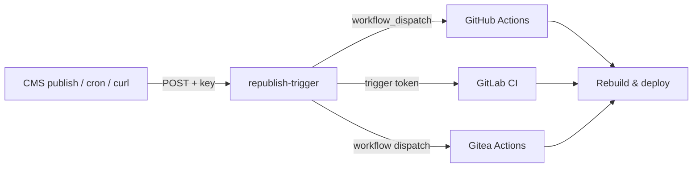

For a while SSG had exactly one escape hatch from "everything is static": a `worker:` block that dropped a single Cloudflare Pages Functions tree into your build. That was enough for a contact form or a Stripe checkout. It stopped being enough the moment you wanted two of them.

1.8.13 is the release where that hook grows up. `worker:` becomes `workers:` — a list of independent workers that share one Pages project — and three of them now come in the box: a GDPR cookie banner, a comment system, and a webhook that rebuilds your site. Around that sits the plumbing you need to actually run several of them: split configuration, a `wrangler.toml` generator, and a local dev path that serves Functions the way production does.

None of this changes the deal. Your pages are still pre-baked HTML on a CDN. The dynamic parts are opt-in, and they run at the edge, next to the content — not in a Node server you now have to babysit.

## Several workers, one project

Cloudflare Pages compiles exactly one `functions/` tree per project and serves it behind one `_routes.json`. So "multiple workers" can't mean multiple deployments — it has to mean several worker definitions that merge cleanly into that single tree.

That's what `workers:` does:

```yaml
workers:
  - name: cookie-consent
    dir: workers/cookie-consent
    routes_include: [/api/consent/*]
  - name: comments
    dir: workers/comments
    routes_include: [/api/comments, /api/comments/*]
```

Each worker keeps its own routes, its own `public/` assets, and its own optional remote `source:`. At build time SSG merges their `functions/` trees and combines their routes. If two workers try to write the same output file, that's a hard error — never a silent overwrite. You find out at build, not when a request quietly hits the wrong handler in production.

The old singular `worker:` still works, untouched. If you have one worker, nothing changes.

## Config that splits

Once a project has three or four workers, its `.ssg.yaml` gets long, and every worker's settings pile up in one file that three people keep editing. So configs can now `include:` other files — from a path or a URL:

```yaml
include:
  - workers/comments/config.yaml
  - url: https://config.example.com/base.yaml
    auth: { type: bearer, token: $CONFIG_TOKEN }
```

Merging is base-first: includes are applied in order, then the main file overlays on top and always wins. Maps merge recursively; lists of workers or content sources merge by `name`, so each worker's own file can contribute one entry without clobbering the others. It's the kustomize idea, scoped to a single config file.

Two things I care about here. Secrets never live in the file — an `auth` token has to reference an environment variable (`$CONFIG_TOKEN`), never a literal. And the fetch behind a remote include is hardened: it's size-capped, redirect-bounded, and it drops your credential the moment a server tries to redirect it to a different host. A config server can't bounce your token to somebody else's domain.

## Cookie consent that actually follows the rules

The `cookie-consent` worker is a GDPR / ePrivacy / UK-PECR banner, and it's opinionated about the parts people usually get wrong:

- **Prior consent.** Non-essential scripts stay inert — you mark them `<script type="text/plain" data-consent-category="analytics">` and they don't run until the visitor grants that category.
- **Reject is as easy as accept.** Both are one click, same prominence. No dark-pattern "manage my 47 partners" maze behind the reject button.
- **Geo-gating at the edge.** A tiny Function reads `request.cf.country` and only shows the banner in the EEA and UK, so visitors elsewhere aren't nagged for a consent they don't legally owe.
- **Consent Mode v2** signals fire for Google tags, and there's an optional audit log for the "prove they consented" requirement — storing only a salted hash of the IP, never the address itself.

It ships translated (English, Polish, German, French), picks the language from `<html lang>`, and comes with a starter `cookie-policy.md` you edit to list your own services.

## Comments, without the account system

The `comments` worker is the one I expected to be a slog and wasn't. The decision that made it simple: no accounts. A comment is a name, an optional email (used only for a Gravatar hash), and a body. No login, no OAuth, no password reset flow to build.

What it does have:

- **Cloudflare D1** for storage, **Turnstile** on submit, and a **heuristic spam score** (drop in an Akismet key if you want real scoring).
- **Moderation by default.** New comments land as `pending` and are invisible until you approve them in a password-protected panel. Nothing a stranger types appears unreviewed.
- **A migration path.** An admin-only import endpoint takes a normalized JSON array, so moving off Disqus or WordPress is a convert-and-POST. It's idempotent — re-running the same export inserts nothing new.
- **Auto-close.** Set `COMMENTS_CLOSE_AFTER_DAYS` and a thread stops taking comments once it's been quiet that long, which is most of your spam surface gone for free.

For compliance it keeps a salted hash of the IP and the user agent — enough to answer an abuse report, not enough to profile anyone. The widget is dependency-free, XSS-safe (every field goes in as text, never HTML), and translated the same way the banner is.

## A button that rebuilds the site

The `republish-trigger` worker is small and does one thing: it's a single authenticated URL that fires a CI build on GitHub, GitLab, or Gitea.



Point your headless CMS's "content published" webhook at it, or hit it from a cron, and the site rebuilds. The caller proves itself with a shared key you choose; the CI token stays server-side and is never handed back. There's an optional KV-backed debounce so a burst of edits collapses into one build instead of ten.

(If you're wondering whether those pipelines can live on GitLab or Gitea in the first place: Gitea runs GitHub-Actions syntax almost as-is, and GitLab is a straightforward rewrite because the whole build is `go build` plus `ssg --deploy`. The worker is provider-agnostic on purpose.)

## The boring plumbing that makes it usable

Two smaller things that remove friction:

**A wrangler generator.** The first time you build a project with workers, SSG writes a starter `wrangler.toml` if you don't have one — deriving the project name and output directory from your config and folding in each worker's binding stubs. It never overwrites a config you already wrote.

**Local dev that matches production.** `ssg --watch` now runs `wrangler pages dev` from the output directory, so your Functions compile and serve alongside the static pages exactly as they will on Pages. Previously the static site and the Functions didn't come up together locally, which made "works on my machine" mean very little.

## And one small thing for the diagrams

If you use Mermaid diagrams, you can now set their background:

```yaml
mermaid: true
mermaid_theme: neutral
mermaid_background: "#ffffff"
```

Diagrams render transparent by default, which is unreadable on a dark page. The two diagrams in this post sit on a white panel because of exactly that setting — a two-line fix for something that had been quietly annoying.

## Getting it

Scaffold any of the workers with `ssg new worker <name>`:

```sh
ssg new worker cookie-consent
ssg new worker comments
ssg new worker republish-trigger
```

Each one drops its files into `workers/<name>/` and prints the config block to paste and the secrets to set. The [worker guide](/deployment/) has the per-provider setup, and every worker ships its own README with the D1 / Turnstile / secret wiring.

Static-first was never about avoiding dynamic features. It was about not paying for a server to render text. 1.8.13 keeps that bargain and gives you the dynamic parts as small, self-contained pieces you bolt on where you actually need them.
