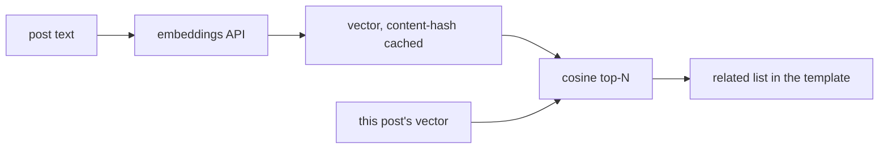

# Related posts — three ways

"Show 5 articles related to this one" has three levels, cheapest first. Pick the
one that matches how good the matches need to be and where the candidates live.

## 1. Keyword overlap (built in, deterministic)

The `related` template helper ranks the posts SSG already loaded by how many
**tags and keywords** they share with the current page — no configuration, no
network, reproducible.

**What you need:** posts that carry `tags:` and/or `keywords:` in frontmatter.

```gotemplate
<!-- in post.html -->
<aside class="related">
  <h2>Related</h2>
  <ul>
    {{ range related . 5 }}
      <li><a href="{{ .Link }}">{{ .Title }}</a></li>
    {{ end }}
  </ul>
</aside>
```

Ranking is overlap count, then recency, then slug (a total, stable order), and
posts with no shared term are dropped. This is the right default for "related
among my own posts".

## 2. The whole mddb corpus (live query)

`relatedFromMddb` asks the **mddb** server for posts sharing this page's
tags/keywords, so it can surface articles that are *not* built into this
particular site — useful when one mddb database backs several sites, or when the
build is a subset of a large archive.

**What you need:** an `mddb:` content source configured (`docs/EXTERNAL_SOURCES.md`
/ the `mddb` config block). It is a **live query** — not cached — so the build
touches the network and the result tracks the database.

```yaml
mddb:
  enabled: true
  url: https://mddb.example.com
  collection: blog
```

```gotemplate
{{ range relatedFromMddb . 5 }}
  <li><a href="{{ .Link }}">{{ .Title }}</a></li>
{{ end }}
```

## 3. Semantic related — embeddings + vector search

Keyword overlap misses posts that are *about* the same thing in different words.
Embeddings fix that: turn each post into a vector, then rank by cosine similarity.

**What you need**, and the shape of the pipeline:

1. **An embeddings model.** Any embeddings endpoint (OpenAI `text-embedding-3-small`,
   a self-hosted model, …). Reuse the same secret-from-env pattern as the `ai:`
   config — the key lives in `$ENV`, never in the file.
2. **A vector per post, cached.** At (or before) build, embed each post's text and
   store the vector keyed by a content hash — exactly like the `[ai …]` answer
   cache, so a vector is recomputed only when the post changes and the build stays
   reproducible. Commit the vector store and CI needs no key.
3. **A nearest-neighbour lookup.** For the current post's vector, take the top-N by
   cosine similarity. For a few thousand posts a linear scan at build time is
   plenty; past that, use an index (mddb's vector search if your server exposes
   it, or a prebuilt ANN index loaded via `data_dir`).
4. **Render** the resulting slugs the same way as above.



The trade-off ladder: **keyword** is free and offline but literal; **mddb** reaches
the whole corpus but is a live query; **embeddings** are the best matches but cost
an embedding call per changed post (once, thanks to the cache) and a similarity
pass. Start at level 1; climb only when the matches aren't good enough.
